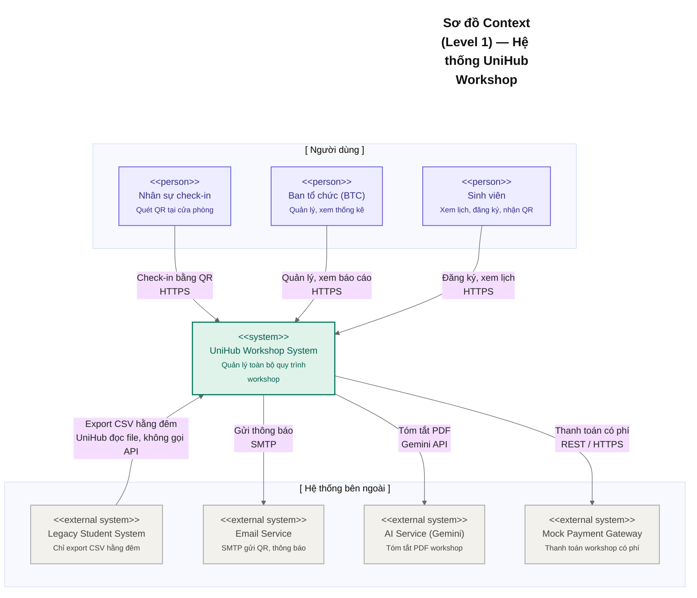
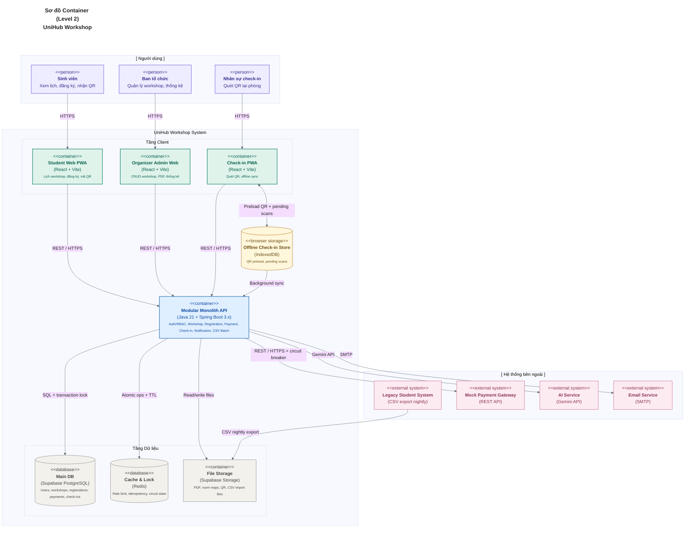
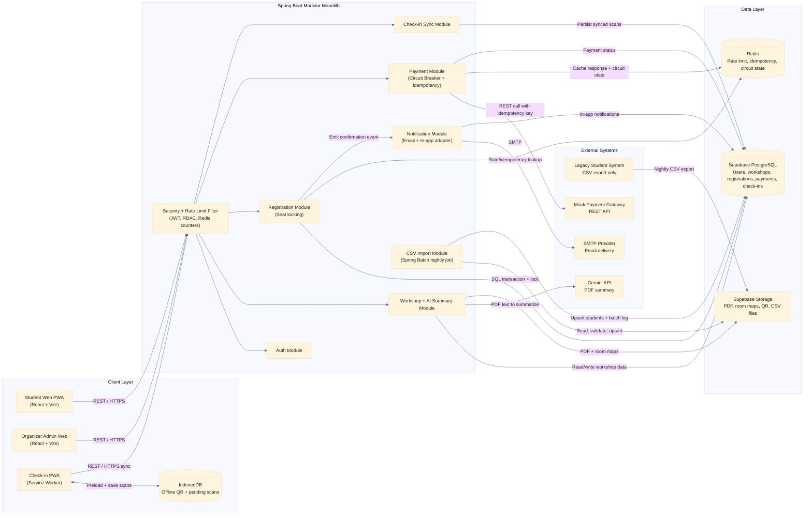
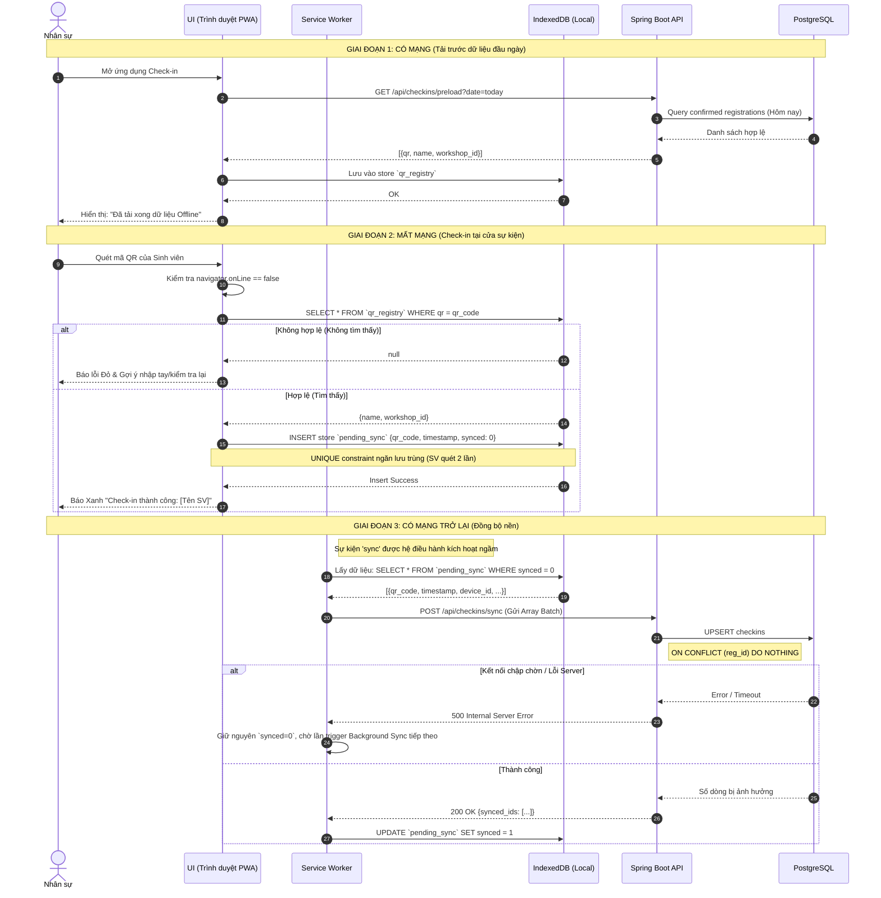
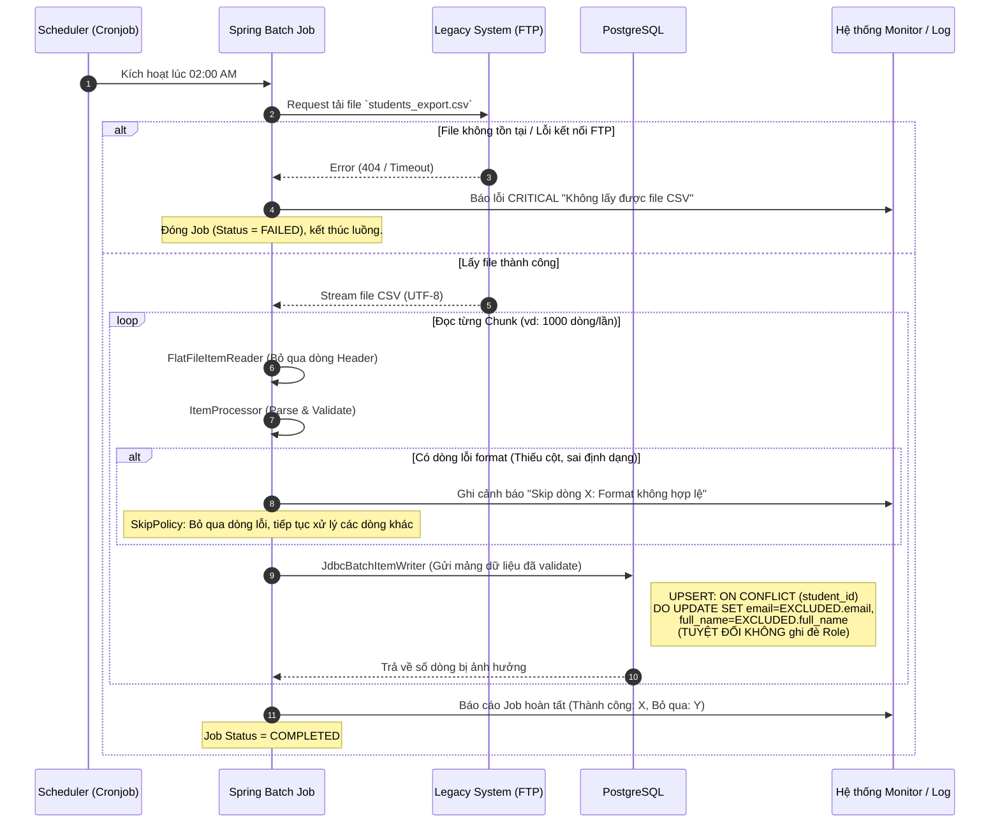

# UniHub Workshop — Technical Design

> **Stack đã chốt:** Java 21 + Spring Boot 3.x · React + Vite PWA · Service Worker + IndexedDB · Supabase (PostgreSQL + Storage) · Redis · Gemini API · SMTP
>
> **Phân công:** Thành viên 1 — Đăng ký & Giao dịch | Thành viên 2 — Quản trị & AI | Thành viên 3 — Vận hành & Đồng bộ

---

## 1. Kiến trúc tổng thể

### Lựa chọn kiến trúc: Modular Monolith

Nhóm chọn kiến trúc **Modular Monolith** cho backend Spring Boot. Toàn bộ nghiệp vụ nằm trong một deployable unit duy nhất, nhưng được tổ chức thành các module/package độc lập theo domain:

```
com.unihub.workshop
├── module.auth          (TV2 — Spring Security, JWT)
├── module.workshop      (TV1, TV2 — CRUD, AI summary)
├── module.registration  (TV1 — đăng ký, seat locking)
├── module.payment       (TV1 — Circuit Breaker, Idempotency)
├── module.checkin       (TV3 — API ghi nhận, sync offline)
├── module.notification  (TV3 — Email, in-app)
└── module.csvimport     (TV3 — Spring Batch)
```

**Lý do không chọn Microservices:**

| Tiêu chí                     | Modular Monolith           | Microservices                  |
| ---------------------------- | -------------------------- | ------------------------------ |
| Thời gian setup              | Thấp — 1 project, 1 repo   | Cao — nhiều repo, service mesh |
| Phù hợp nhóm 3 người, 1 tuần | ✅                         | ❌                             |
| Giao tiếp giữa module        | Method call (zero latency) | HTTP/gRPC (network overhead)   |
| Debug và test                | Dễ — chạy 1 service        | Khó — nhiều service cùng lúc   |
| Ranh giới module rõ ràng     | ✅ (package private)       | ✅                             |
| Có thể tách ra sau này       | ✅ (ranh giới đã có sẵn)   | N/A                            |

**Lý do chọn Java 21 + Spring Boot 3.x:**

- **Spring Batch:** Giải quyết bài toán CSV import phức tạp với cơ chế chunk processing, retry, skip, restart — không cần tự viết từ đầu.
- **Resilience4j:** Tích hợp sẵn Circuit Breaker, Rate Limiter, Retry với annotation `@CircuitBreaker`, `@RateLimiter` — không cần tự implement thuật toán.
- **Spring Security:** RBAC + JWT filter chain được thiết lập chặt chẽ, không để lọt request không hợp lệ qua bất kỳ tầng nào.
- **JPA + Pessimistic Locking:** `@Lock(LockModeType.PESSIMISTIC_WRITE)` giải quyết race condition chỗ ngồi trực tiếp ở tầng ORM.

---

## 2. C4 Diagram

### Level 1 — System Context

Sơ đồ này thể hiện UniHub Workshop trong bức tranh toàn cảnh: ai dùng hệ thống và hệ thống ngoài nào được tích hợp.



### Level 2 — Container Diagram

Sơ đồ này phân rã UniHub Workshop thành các container, chỉ rõ công nghệ và cách giao tiếp.



---

## 3. High-Level Architecture Diagram

Sơ đồ này thể hiện luồng dữ liệu và điểm tích hợp quan trọng, đặc biệt ở các tình huống phức tạp.



## 4. Thiết kế cơ sở dữ liệu

### Lựa chọn database

| Nhu cầu                                                                 | Lựa chọn                | Lý do                                                                                                              |
| ----------------------------------------------------------------------- | ----------------------- | ------------------------------------------------------------------------------------------------------------------ |
| Dữ liệu nghiệp vụ (users, workshops, registrations, payments, checkins) | **Supabase PostgreSQL** | ACID bắt buộc cho seat locking và thanh toán; Supabase có sẵn Real-time WebSocket để cập nhật số ghế trên frontend |
| Rate limiting counter, idempotency key cache, Circuit Breaker state     | **Redis**               | Atomic operations (INCR, SET NX EX), TTL tự động, dưới 1ms latency                                                 |
| File storage (PDF, ảnh sơ đồ phòng)                                     | **Supabase Storage**    | S3-compatible, tích hợp sẵn với Supabase, không cần cấu hình thêm                                                  |

**Không dùng NoSQL** cho dữ liệu nghiệp vụ vì: dữ liệu có quan hệ rõ ràng (user → registration → payment → workshop), cần JOIN và transaction ACID, và PostgreSQL Pessimistic Lock là công cụ chuẩn cho bài toán seat contention.

### Schema PostgreSQL

```sql
-- =============================================
-- ENUM types
-- =============================================
CREATE TYPE user_role AS ENUM ('STUDENT', 'ORGANIZER', 'CHECKIN_STAFF');
CREATE TYPE workshop_status AS ENUM ('DRAFT', 'PUBLISHED', 'CANCELLED');
CREATE TYPE registration_status AS ENUM (
    'PENDING',      -- Đang xử lý thanh toán
    'CONFIRMED',    -- Đã thanh toán / đã đăng ký miễn phí thành công
    'CANCELLED',    -- Đã hủy (thanh toán lỗi hoặc SV hủy)
    'WAITLISTED'    -- Hết chỗ, vào danh sách chờ
);
CREATE TYPE payment_status AS ENUM ('PENDING', 'SUCCESS', 'FAILED', 'REFUNDED');

-- =============================================
-- Bảng người dùng
-- =============================================
CREATE TABLE users (
    id          UUID PRIMARY KEY DEFAULT gen_random_uuid(),
    student_id  VARCHAR(20) UNIQUE,          -- Mã SV, null nếu là Organizer/Staff
    email       VARCHAR(255) UNIQUE NOT NULL,
    full_name   VARCHAR(255) NOT NULL,
    role        user_role NOT NULL DEFAULT 'STUDENT',
    is_active   BOOLEAN NOT NULL DEFAULT true,
    created_at  TIMESTAMPTZ NOT NULL DEFAULT now(),
    updated_at  TIMESTAMPTZ NOT NULL DEFAULT now()
);

-- =============================================
-- Bảng workshop
-- =============================================
CREATE TABLE workshops (
    id               UUID PRIMARY KEY DEFAULT gen_random_uuid(),
    title            VARCHAR(500) NOT NULL,
    description      TEXT,
    speaker_name     VARCHAR(255),
    speaker_bio      TEXT,
    room             VARCHAR(100) NOT NULL,
    room_layout_url  TEXT,                    -- URL ảnh sơ đồ phòng (Supabase Storage)
    start_time       TIMESTAMPTZ NOT NULL,
    end_time         TIMESTAMPTZ NOT NULL,
    capacity         INT NOT NULL CHECK (capacity > 0),
    remaining_seats  INT NOT NULL CHECK (remaining_seats >= 0),
    price            NUMERIC(10,2) NOT NULL DEFAULT 0.00, -- 0 = miễn phí
    status           workshop_status NOT NULL DEFAULT 'DRAFT',
    pdf_url          TEXT,                    -- URL file PDF (Supabase Storage)
    ai_summary       TEXT,                    -- Tóm tắt do Gemini API tạo
    ai_summary_status VARCHAR(20) DEFAULT 'NONE', -- NONE/PROCESSING/DONE/FAILED
    created_by       UUID NOT NULL REFERENCES users(id),
    created_at       TIMESTAMPTZ NOT NULL DEFAULT now(),
    updated_at       TIMESTAMPTZ NOT NULL DEFAULT now(),

    CONSTRAINT remaining_lte_capacity CHECK (remaining_seats <= capacity)
);

-- =============================================
-- Bảng đăng ký
-- =============================================
CREATE TABLE registrations (
    id            UUID PRIMARY KEY DEFAULT gen_random_uuid(),
    user_id       UUID NOT NULL REFERENCES users(id) ON DELETE RESTRICT,
    workshop_id   UUID NOT NULL REFERENCES workshops(id) ON DELETE RESTRICT,
    status        registration_status NOT NULL DEFAULT 'PENDING',
    qr_code       VARCHAR(255) UNIQUE,        -- UUID ngẫu nhiên, chỉ sinh khi CONFIRMED
    registered_at TIMESTAMPTZ NOT NULL DEFAULT now(),
    confirmed_at  TIMESTAMPTZ,
    cancelled_at  TIMESTAMPTZ,

    UNIQUE (user_id, workshop_id)             -- Một SV không đăng ký 2 lần cùng 1 workshop
);

-- =============================================
-- Bảng thanh toán
-- =============================================
CREATE TABLE payments (
    id               UUID PRIMARY KEY DEFAULT gen_random_uuid(),
    registration_id  UUID NOT NULL REFERENCES registrations(id),
    idempotency_key  VARCHAR(255) UNIQUE NOT NULL,  -- UUID do client gửi
    amount           NUMERIC(10,2) NOT NULL,
    status           payment_status NOT NULL DEFAULT 'PENDING',
    gateway_ref      VARCHAR(255),            -- Mã giao dịch từ Mock Payment GW
    gateway_response JSONB,                   -- Raw response để debug
    created_at       TIMESTAMPTZ NOT NULL DEFAULT now(),
    updated_at       TIMESTAMPTZ NOT NULL DEFAULT now()
);

-- =============================================
-- Bảng check-in
-- =============================================
CREATE TABLE checkins (
    id              UUID PRIMARY KEY DEFAULT gen_random_uuid(),
    registration_id UUID NOT NULL REFERENCES registrations(id),
    checked_in_at   TIMESTAMPTZ NOT NULL,     -- Thời điểm quét QR (local device time)
    synced_at       TIMESTAMPTZ,              -- null = chưa sync từ offline
    device_id       VARCHAR(255),             -- ID thiết bị nhân sự
    created_at      TIMESTAMPTZ NOT NULL DEFAULT now(),

    UNIQUE (registration_id)                  -- Mỗi SV chỉ check-in 1 lần
);

-- =============================================
-- Bảng batch import CSV
-- =============================================
CREATE TABLE student_import_batches (
    id            UUID PRIMARY KEY DEFAULT gen_random_uuid(),
    file_name     VARCHAR(500),
    total_rows    INT DEFAULT 0,
    success_rows  INT DEFAULT 0,
    error_rows    INT DEFAULT 0,
    status        VARCHAR(20) NOT NULL DEFAULT 'RUNNING',  -- RUNNING/COMPLETED/FAILED/SKIPPED
    error_log     TEXT,                       -- Chi tiết các dòng bị lỗi
    started_at    TIMESTAMPTZ NOT NULL DEFAULT now(),
    completed_at  TIMESTAMPTZ
);

-- =============================================
-- Indexes
-- =============================================
CREATE INDEX idx_workshops_start_time   ON workshops(start_time);
CREATE INDEX idx_workshops_status       ON workshops(status);
CREATE INDEX idx_workshops_remaining    ON workshops(remaining_seats) WHERE remaining_seats > 0;
CREATE INDEX idx_registrations_user     ON registrations(user_id);
CREATE INDEX idx_registrations_workshop ON registrations(workshop_id);
CREATE INDEX idx_registrations_qr       ON registrations(qr_code) WHERE qr_code IS NOT NULL;
CREATE INDEX idx_registrations_status   ON registrations(status);
CREATE INDEX idx_checkins_unsynced      ON checkins(registration_id) WHERE synced_at IS NULL;
CREATE INDEX idx_payments_idem          ON payments(idempotency_key);
```

### Redis Key Convention

| Key Pattern             | Type             | TTL          | Mục đích                                          |
| ----------------------- | ---------------- | ------------ | ------------------------------------------------- |
| `rl:user:{userId}`      | String (counter) | 10s          | Rate limiting per user (Resilience4j + Redis)     |
| `rl:ip:{ipAddress}`     | String (counter) | 60s          | Rate limiting per IP (fallback)                   |
| `idem:{idempotencyKey}` | String (JSON)    | 86400s (24h) | Cache response thanh toán chống double-charge     |
| `cb:payment:failures`   | String (counter) | 30s          | Đếm failures trong Circuit Breaker sliding window |
| `cb:payment:state`      | String           | —            | Trạng thái CB: CLOSED / OPEN / HALF_OPEN          |
| `ws:seats:{workshopId}` | String           | 30s          | Cache số ghế còn lại (giảm tải DB reads)          |

---

## 5. Thiết kế kiểm soát truy cập (RBAC)

### 5.1. Mục tiêu
Hệ thống UniHub Workshop có nhiều nhóm người dùng với quyền hạn khác nhau. Vì vậy, hệ thống cần có cơ chế kiểm soát truy cập để đảm bảo mỗi người dùng chỉ được thực hiện đúng các chức năng thuộc phạm vi của mình: Sinh viên chỉ được xem và đăng ký workshop; Ban tổ chức (BTC) được quản lý workshop; Nhân sự chỉ được thực hiện quét QR check-in.

### 5.2. Mô hình kiểm soát truy cập
Hệ thống áp dụng mô hình **RBAC (Role-Based Access Control)** thông qua Spring Security + JWT. Trong phạm vi đồ án chỉ có 3 role đúng với đề bài và schema PostgreSQL: `STUDENT`, `ORGANIZER`, `CHECKIN_STAFF`. Mỗi JWT access token chứa claim `role`; backend dùng claim này để kiểm tra quyền ở tầng route và method.

```json
{
  "sub": "550e8400-e29b-41d4-a716-446655440000",
  "email": "nguyenvana@university.edu.vn",
  "role": "STUDENT",
  "iat": 1748908800,
  "exp": 1748995200
}
```

### 5.3. Các vai trò trong hệ thống
* **STUDENT (Sinh viên):** Xem lịch workshop, đăng ký workshop, nhận mã QR và xem trạng thái check-in của chính mình.
* **ORGANIZER (Ban tổ chức):** Tạo, sửa, hủy workshop, upload tài liệu PDF giới thiệu, xem danh sách sinh viên đăng ký và xem báo cáo thống kê.
* **CHECKIN_STAFF (Nhân sự check-in):** Preload danh sách QR hợp lệ, quét QR tại cửa phòng và đồng bộ các lượt check-in offline.

Tài khoản `ORGANIZER` và `CHECKIN_STAFF` được tạo thủ công qua seed data/DBA cho phạm vi đồ án, không mở API public để tự gán role. Vì vậy hệ thống không định nghĩa role `ADMIN` riêng trong runtime; các đường dẫn quản trị nghiệp vụ thuộc role `ORGANIZER`.

### 5.4. Phân quyền chức năng (Functional Permissions)

| Chức năng / Endpoint | STUDENT | ORGANIZER | CHECKIN_STAFF |
| :--- | :---: | :---: | :---: |
| Xem danh sách / chi tiết workshop (`GET /api/workshops/**`) | ✅ | ✅ | ✅ |
| Đăng ký workshop (`POST /api/registrations/**`) | ✅ | ❌ | ❌ |
| Xem registration / mã QR của chính mình (`GET /api/registrations/my/**`) | ✅ | ❌ | ❌ |
| Tạo / cập nhật / hủy workshop (`POST/PUT/DELETE /api/workshops/**`) | ❌ | ✅ | ❌ |
| Upload PDF giới thiệu workshop (`POST /api/admin/workshops/{id}/pdf`) | ❌ | ✅ | ❌ |
| Xem danh sách sinh viên đăng ký / thống kê (`GET /api/admin/**`) | ❌ | ✅ | ❌ |
| Preload danh sách QR hợp lệ (`GET /api/checkins/preload`) | ❌ | ❌ | ✅ |
| Quét QR / đồng bộ check-in offline (`POST /api/checkins/**`) | ❌ | ❌ | ✅ |

### 5.5. Kiểm soát truy cập tại API Endpoint
Tất cả request từ Student Web, Organizer Admin Web và Check-in PWA đều phải đi qua Backend API do Backend API là nơi kiểm tra quyền chính thức của hệ thống. Frontend chỉ ẩn/hiện route và nút chức năng theo role để cải thiện UX; bảo mật thật sự phải được kiểm tra ở backend.

**Quy trình kiểm tra quyền tại API:**
1. Người dùng đăng nhập vào hệ thống.
2. Backend xác thực tài khoản và trả về **JWT Access Token**.
3. Client lưu token và gửi token trong mỗi request: `Authorization: Bearer <access_token>`.
4. `JwtAuthenticationFilter` kiểm tra token có tồn tại, hợp lệ và chưa hết hạn.
5. Backend kiểm tra role của user với endpoint đang được gọi.
6. Nếu không đăng nhập hoặc token sai, trả về `401 Unauthorized`.
7. Nếu token đúng nhưng role không đủ quyền, trả về `403 Forbidden`.

**Triển khai trong Spring Security (Thành viên 2):**

**Tầng 1 — HTTP Security Config:**

```java
@Bean
public SecurityFilterChain filterChain(HttpSecurity http) throws Exception {
    http
        .csrf(AbstractHttpConfigurer::disable)
        .sessionManagement(s -> s.sessionCreationPolicy(STATELESS))
        .authorizeHttpRequests(auth -> auth
            // Public endpoints
            .requestMatchers(GET, "/api/workshops/**").permitAll()
            .requestMatchers(POST, "/api/auth/**").permitAll()

            // Student only
            .requestMatchers(POST, "/api/registrations/**").hasRole("STUDENT")
            .requestMatchers(GET, "/api/registrations/my/**").hasRole("STUDENT")

            // Organizer only
            .requestMatchers("/api/admin/**").hasRole("ORGANIZER")
            .requestMatchers(POST, "/api/workshops/**").hasRole("ORGANIZER")
            .requestMatchers(PUT, "/api/workshops/**").hasRole("ORGANIZER")
            .requestMatchers(DELETE, "/api/workshops/**").hasRole("ORGANIZER")

            // Check-in staff only
            .requestMatchers("/api/checkins/**").hasRole("CHECKIN_STAFF")

            .anyRequest().authenticated()
        )
        .addFilterBefore(jwtAuthenticationFilter,
                         UsernamePasswordAuthenticationFilter.class);
    return http.build();
}
```

**Tầng 2 — Method-level Security (defense in depth):**

```java
@Service
@PreAuthorize("hasRole('ORGANIZER')")
public class WorkshopAdminService {
    public Workshop createWorkshop(CreateWorkshopRequest req) { ... }
    public Workshop updateWorkshop(UUID id, UpdateWorkshopRequest req) { ... }
}
```

**Tầng 3 — Data-level: SV chỉ xem được registration của chính mình:**

```java
@GetMapping("/registrations/my")
public List<RegistrationDto> getMyRegistrations(
        @AuthenticationPrincipal UserDetails user) {
    // userDetails.getId() lấy từ JWT, không tin vào request param
    return registrationService.findByUserId(user.getId());
}
```

**Tầng 4 — Frontend route guard theo role:**

```jsx
<RoleGuard allowedRoles={['STUDENT']}>
  <StudentLayout />
</RoleGuard>

<RoleGuard allowedRoles={['ORGANIZER']}>
  <OrganizerLayout />
</RoleGuard>

<RoleGuard allowedRoles={['CHECKIN_STAFF']}>
  <CheckinLayout />
</RoleGuard>
```

Route guard chỉ là lớp hỗ trợ giao diện. Người dùng tự sửa URL hoặc token không hợp lệ vẫn bị backend chặn ở tầng Spring Security.

---

## 6. Luồng nghiệp vụ quan trọng

### Luồng A — Đăng ký Workshop có phí (Thành viên 1)

Từ lúc sinh viên bấm "Đăng ký" đến khi nhận mã QR.

```
SV (Browser)         React Frontend        Spring Boot API         Redis / PostgreSQL
      │                     │                     │                       │
      │── Click "Đăng ký" ─▶│                     │                       │
      │                     │ Sinh idempotencyKey  │                       │
      │                     │ = UUID.randomUUID()  │                       │
      │                     │                     │                       │
      │                     │──POST /registrations▶│                       │
      │                     │  Header:             │                       │
      │                     │  Idempotency-Key:    │                       │
      │                     │  {uuid}              │                       │
      │                     │  Body: {workshopId}  │                       │
      │                     │                     │                       │
      │                     │                     │── ① Rate limit check ─▶│ Redis INCR rl:user:{id}
      │                     │                     │◀─ OK (< 5 req/10s) ───│
      │                     │                     │   hoặc 429 (exceeded) │
      │                     │                     │                       │
      │                     │                     │── ② Idem key check ──▶│ Redis GET idem:{key}
      │                     │                     │◀─ null (chưa có) ─────│
      │                     │                     │   (nếu có → return    │
      │                     │                     │    cached response)   │
      │                     │                     │                       │
      │                     │                     │── ③ BEGIN TRANSACTION ─▶│ PostgreSQL
      │                     │                     │   SELECT * FROM         │
      │                     │                     │   workshops             │
      │                     │                     │   WHERE id = ?          │
      │                     │                     │   FOR UPDATE            │ ← Pessimistic Lock
      │                     │                     │                         │
      │                     │                     │   remaining_seats = 0?  │
      │                     │                     │   → ROLLBACK            │
      │                     │                     │   → 409 Conflict        │
      │                     │                     │                         │
      │                     │                     │   INSERT registrations  │
      │                     │                     │   status = 'PENDING'    │
      │                     │                     │                         │
      │                     │                     │   UPDATE workshops      │
      │                     │                     │   SET remaining_seats   │
      │                     │                     │       = remaining_seats │
      │                     │                     │       - 1               │
      │                     │                     │                         │
      │                     │                     │   INSERT payments       │
      │                     │                     │   status = 'PENDING'    │
      │                     │                     │── COMMIT ───────────────│
      │                     │                     │                         │
      │                     │                     │── ④ Call Payment GW ───── (Circuit Breaker)
      │                     │                     │   POST mock-payment/pay │
      │                     │                     │   + Idempotency-Key hdr │
      │                     │                     │                         │
      │                     │                     │◀─── [Kịch bản SUCCESS] ──
      │                     │                     │   UPDATE payments       │
      │                     │                     │   status = 'SUCCESS'    │
      │                     │                     │   UPDATE registrations  │
      │                     │                     │   status = 'CONFIRMED'  │
      │                     │                     │   qr_code = UUID.new()  │
      │                     │                     │── ⑤ Cache idem key ────▶│ Redis SET idem:{key}
      │                     │                     │                    EX 86400
      │                     │                     │── ⑥ Send Email ─────────── EmailService (async)
      │                     │◀── 201 {qrCode} ────│                         │
      │◀── Hiển thị QR ─────│                     │                         │
      │                     │                     │                         │
      │                     │                     │◀─── [Kịch bản TIMEOUT] ──
      │                     │                     │   UPDATE payments FAILED│
      │                     │                     │   UPDATE registrations  │
      │                     │                     │   status = 'CANCELLED'  │
      │                     │                     │   UPDATE workshops      │
      │                     │                     │   remaining_seats += 1  │ ← Hoàn lại ghế
      │                     │◀── 504 + message ───│                         │
      │◀── "Thanh toán lỗi, │                     │                         │
      │    vui lòng thử lại"│                     │                         │
      │                     │                     │                         │
      │                     │                     │◀─── [CB OPEN state] ─────
      │                     │                     │   Ngay lập tức 503      │
      │                     │                     │   Không gọi gateway     │
      │                     │                     │   remaining_seats += 1  │
      │                     │◀── 503 + message ───│                         │
```

**Kịch bản client retry với cùng idempotency key:**

```
Client gửi lại request với cùng Idempotency-Key
→ API: Redis GET idem:{key} → Tìm thấy response cũ
→ Return cached response ngay, không xử lý lại
→ Header: X-Idempotent-Replayed: true
```

### Luồng B — Check-in offline và đồng bộ (Thành viên 3)



```
Nhân sự (PWA)        Service Worker        Spring Boot API        IndexedDB    PostgreSQL
      │                    │                      │                    │             │
      │ [Trước sự kiện - có mạng]                 │                    │             │
      │── Mở app ─────────▶│                      │                    │             │
      │                    │── GET /checkins/      │                    │             │
      │                    │   preload?date=today ▶│                    │             │
      │                    │                      │── Query confirmed ──│─────────────▶
      │                    │◀── [{qr, name,        │    registrations   │             │
      │                    │     workshopId}]      │    for today       │             │
      │                    │── Cache vào ──────────│────────────────────▶│            │
      │                    │   IndexedDB           │                    │ INSERT batch│
      │◀── "Đã tải xong" ──│                      │                    │             │
      │                    │                      │                    │             │
      │ [Tại cửa phòng - mất mạng]               │                    │             │
      │── Quét QR SV ─────▶│                      │                    │             │
      │                    │── navigator.onLine?  │                    │             │
      │                    │   = false            │                    │             │
      │                    │── Lookup local ───────│────────────────────▶│            │
      │                    │◀── {name, workshop}   │                    │ SELECT by   │
      │                    │                       │                    │ qr_code     │
      │                    │── Save pending ───────│────────────────────▶│            │
      │                    │   checkin             │                    │ INSERT:     │
      │                    │                       │                    │ {qr_code,   │
      │                    │                       │                    │  timestamp, │
      │                    │                       │                    │  synced:0}  │
      │◀── "Check-in OK!" ─│                      │                    │             │
      │    (hiển thị tên)  │                      │                    │             │
      │                    │                      │                    │             │
      │ [Khi mạng trở lại]                        │                    │             │
      │                    │── Background Sync ────│                    │             │
      │                    │   event triggered     │                    │             │
      │                    │── GET pending ─────────│────────────────────▶│            │
      │                    │   WHERE synced=0      │                    │ SELECT      │
      │                    │── POST /checkins/sync▶│                    │             │
      │                    │   [{qr_code,          │                    │             │
      │                    │     timestamp,        │── UPSERT ──────────│─────────────▶
      │                    │     device_id}]       │   checkins         │             │ ON CONFLICT
      │                    │                      │   ON CONFLICT      │             │ (reg_id)
      │                    │◀── {synced: [ids]} ───│   DO NOTHING       │             │ DO NOTHING
      │                    │── Mark synced=1 ───────│────────────────────▶│            │
      │                    │                      │                    │ UPDATE      │
```

**Xử lý lỗi:**

| Tình huống                   | Hành vi                                                                                           |
| ---------------------------- | ------------------------------------------------------------------------------------------------- |
| QR không có trong IndexedDB  | Hiện "Không tìm thấy sinh viên", ghi log, cho phép nhập thủ công                                  |
| Sync thất bại (mạng đứt lại) | Giữ nguyên `synced=0`, Background Sync retry tự động                                              |
| Check-in trùng (SV đã scan)  | IndexedDB UNIQUE constraint ngăn lưu trùng; PostgreSQL `ON CONFLICT DO NOTHING` ngăn trùng server |
| File preload quá lớn         | Phân trang theo `workshop_id`, chỉ load workshop của ngày hôm nay                                 |

---

### Luồng C — Luồng nhập dữ liệu từ CSV đêm (Thành viên 3)



## 7. Thiết kế các cơ chế bảo vệ hệ thống

### 7.1 Kiểm soát tải đột biến — Rate Limiting (Thành viên 1)

**Lý do chọn Sliding Window (Resilience4j):**

So sánh các thuật toán:

| Thuật toán     | Điểm mạnh           | Điểm yếu                            | Phù hợp bài này? |
| -------------- | ------------------- | ----------------------------------- | ---------------- |
| Fixed Window   | Đơn giản            | Burst cuối window: 2× rate trong 1s | ❌               |
| Sliding Window | Công bằng, smooth   | Tốn RAM hơn chút                    | ✅ Chọn          |
| Token Bucket   | Cho phép burst ngắn | Khó integrate với Resilience4j      | Có thể           |
| Leaky Bucket   | Rate đều tuyệt đối  | Queue delay — không công bằng       | ❌               |

Sliding Window được chọn vì: công bằng nhất giữa các sinh viên, Resilience4j hỗ trợ native, không cần tự viết Lua script.

**Cấu hình (application.yml):**

```yaml
resilience4j:
  ratelimiter:
    instances:
      registration:
        limitForPeriod: 5 # 5 requests
        limitRefreshPeriod: 10s # mỗi 10 giây
        timeoutDuration: 0 # fail fast, không queue
      workshop-read:
        limitForPeriod: 30
        limitRefreshPeriod: 10s
        timeoutDuration: 0
```

**Triển khai (Thành viên 1):**

```java
@PostMapping("/registrations")
@RateLimiter(name = "registration", fallbackMethod = "registrationRateLimitFallback")
public ResponseEntity<RegistrationResponse> register(
        @RequestHeader("Idempotency-Key") String idempotencyKey,
        @Valid @RequestBody RegistrationRequest request,
        @AuthenticationPrincipal UserDetails user) {
    return ResponseEntity.status(201)
        .body(registrationService.register(request, user.getId(), idempotencyKey));
}

public ResponseEntity<?> registrationRateLimitFallback(
        String idempotencyKey, RegistrationRequest req,
        UserDetails user, RequestNotPermitted ex) {
    return ResponseEntity.status(429)
        .header("Retry-After", "10")
        .body(ApiResponse.error(429, "Quá nhiều yêu cầu. Vui lòng thử lại sau 10 giây."));
}
```

**Hành vi khi vượt ngưỡng:**

- HTTP 429 với JSON body rõ ràng + header `Retry-After: 10`
- Frontend hiển thị countdown timer, nút đăng ký bị disable
- Không ghi log cho mỗi lần 429 (tránh log flooding)

**Bảo vệ bổ sung tầng Nginx (nếu deploy):**

```nginx
limit_req_zone $binary_remote_addr zone=api:10m rate=60r/m;
limit_req zone=api burst=20 nodelay;
limit_req_status 429;
```

---

### 7.2 Xử lý cổng thanh toán không ổn định — Circuit Breaker (Thành viên 1)

**Cơ chế hoạt động 3 trạng thái:**

```
Trạng thái CLOSED (bình thường):
  → Mọi request gọi Payment Gateway bình thường
  → Đếm failures trong sliding window (10 calls gần nhất)
  → failure rate ≥ 50% → chuyển sang OPEN

Trạng thái OPEN (đang sự cố):
  → Chặn TẤT CẢ request gọi Payment Gateway
  → Trả về lỗi ngay lập tức (không chờ timeout)
  → Sau 30 giây → chuyển sang HALF-OPEN
  → Tính năng KHÔNG liên quan đến thanh toán:
    xem workshop, tìm kiếm, xem QR — vẫn hoạt động 100%

Trạng thái HALF-OPEN (đang thử phục hồi):
  → Cho phép 1 request thử đi qua
  → Thành công → CLOSED (phục hồi)
  → Thất bại → OPEN lại (thêm 30 giây)
```

**Cấu hình (application.yml):**

```yaml
resilience4j:
  circuitbreaker:
    instances:
      payment:
        slidingWindowType: COUNT_BASED
        slidingWindowSize: 10 # Tính trên 10 calls gần nhất
        failureRateThreshold: 50 # 50% failure → OPEN
        slowCallRateThreshold: 80 # 80% slow → cũng tính là failure
        slowCallDurationThreshold: 2000ms # Call > 2s = slow
        waitDurationInOpenState: 30s # OPEN kéo dài 30s
        permittedNumberOfCallsInHalfOpenState: 1
        automaticTransitionFromOpenToHalfOpenEnabled: true
```

**Triển khai (Thành viên 1):**

```java
@Service
public class PaymentService {

    @CircuitBreaker(name = "payment", fallbackMethod = "paymentFallback")
    @Retry(name = "payment")  // Retry 2 lần trước khi tính là failure
    public PaymentResult processPayment(PaymentRequest request) {
        return mockPaymentGatewayClient.pay(request);
    }

    // Fallback khi CB OPEN hoặc sau khi hết retry
    public PaymentResult paymentFallback(PaymentRequest request, Exception ex) {
        log.warn("Payment CB triggered: {}", ex.getMessage());
        throw new PaymentUnavailableException(
            "Hệ thống thanh toán đang gián đoạn. " +
            "Vui lòng thử lại sau ít phút. " +
            "Chức năng xem và tìm kiếm workshop vẫn hoạt động bình thường.");
    }
}
```

**Graceful Degradation — Frontend nhận response:**

```json
// HTTP 503
{
  "status": 503,
  "code": "PAYMENT_UNAVAILABLE",
  "message": "Hệ thống thanh toán đang gián đoạn. Vui lòng thử lại sau ít phút.",
  "data": null
}
```

Frontend hiển thị banner cảnh báo chỉ trên luồng đăng ký có phí. Trang xem danh sách workshop, trang chi tiết, tính năng check-in — không bị ảnh hưởng.

---

### 7.3 Chống trừ tiền hai lần — Idempotency Key (Thành viên 1)

**Cơ chế hoạt động:**

```
TRƯỚC KHI GỌI API:
  Client (React) sinh idempotencyKey = crypto.randomUUID()
  Lưu vào sessionStorage theo workshopId

GỌI API LẦN 1:
  POST /api/registrations
  Header: Idempotency-Key: "550e8400-e29b-41d4-a716-446655440000"

  Server:
  1. Redis GET "idem:550e8400-..."  → null (chưa có)
  2. Xử lý thanh toán (atomic transaction)
  3. Redis SET "idem:550e8400-..." "{response_json}" EX 86400
     (SET NX — chỉ set nếu key chưa tồn tại, atomic)
  4. Return response

CLIENT TIMEOUT → RETRY (cùng key):
  POST /api/registrations
  Header: Idempotency-Key: "550e8400-e29b-41d4-a716-446655440000"

  Server:
  1. Redis GET "idem:550e8400-..."  → "{...response cũ...}"
  2. Return cached response NGAY
     Header: X-Idempotent-Replayed: true
  3. KHÔNG gọi Payment Gateway, KHÔNG trừ tiền lại
```

**Triển khai (Thành viên 1):**

```java
@Component
public class IdempotencyService {
    private final RedisTemplate<String, String> redisTemplate;
    private static final Duration TTL = Duration.ofHours(24);

    public Optional<String> getCachedResponse(String key) {
        try {
            String value = redisTemplate.opsForValue().get("idem:" + key);
            return Optional.ofNullable(value);
        } catch (Exception e) {
            log.warn("Redis unavailable for idempotency check, proceeding without cache");
            return Optional.empty();  // Fail open: tiếp tục xử lý nếu Redis down
        }
    }

    public void cacheResponse(String key, Object response) {
        String json = objectMapper.writeValueAsString(response);
        // SET NX EX: chỉ set nếu chưa có, atomic
        redisTemplate.opsForValue().setIfAbsent("idem:" + key, json, TTL);
    }
}
```

**Ràng buộc bảo mật:**

- Key được bind với `userId` trong validation: key của user A không thể được user B dùng
- TTL 24h: sau 1 ngày key hết hạn, đủ để cover mọi retry trong ngày sự kiện
- Key phải là UUID v4 hợp lệ — bác bỏ key không đúng format với 422

---

## 8. Thiết kế AI Summary (Thành viên 2)

```
Organizer               Spring Boot               Supabase Storage    Gemini API     PostgreSQL
  │                          │                          │                  │               │
  │── Upload PDF ───────────▶│                          │                  │               │
  │                          │── Store PDF ────────────▶│                  │               │
  │                          │◀── pdf_url ──────────────│                  │               │
  │                          │── UPDATE workshops ───────│──────────────────│──────────────▶│
  │                          │   pdf_url = ...,          │                  │               │
  │                          │   ai_summary_status =     │                  │               │
  │                          │   'PROCESSING'            │                  │               │
  │◀── 202 Accepted ─────────│                          │                  │               │
  │    (xử lý nền)           │                          │                  │               │
  │                          │── @Async processAiSummary │                  │               │
  │                          │── Download PDF bytes ────▶│                  │               │
  │                          │◀── PDF bytes ─────────────│                  │               │
  │                          │── Extract text            │                  │               │
  │                          │   (Apache PDFBox)         │                  │               │
  │                          │── Clean text              │                  │               │
  │                          │   (remove headers/footers)│                  │               │
  │                          │── POST generateContent ───│──────────────────▶│              │
  │                          │   {model: gemini-pro,     │                  │               │
  │                          │    contents: [{           │                  │               │
  │                          │      text: "Tóm tắt nội  │                  │               │
  │                          │      dung workshop sau:" │                  │               │
  │                          │      + extractedText}]}   │                  │               │
  │                          │◀── {summary_text} ────────│──────────────────│               │
  │                          │── UPDATE workshops ───────│──────────────────│──────────────▶│
  │                          │   ai_summary = ...,       │                  │               │
  │                          │   ai_summary_status = 'DONE'                 │               │
```

**Xử lý lỗi:** Nếu Gemini API thất bại → `ai_summary_status = 'FAILED'` → Ban tổ chức thấy nút "Thử lại". Không ảnh hưởng đến trang chi tiết workshop (chỉ không hiển thị phần AI Summary).

---

## 9. Thiết kế CSV Import (Thành viên 3)

**Cấu trúc Spring Batch Job:**

```
StudentImportJob
  │
  ├── Step 1: ValidateFileTasklet
  │   ├── Kiểm tra file tồn tại (/data/students_{date}.csv)
  │   ├── Kiểm tra header đúng format (student_id, full_name, email)
  │   ├── Lỗi → INSERT batch record status='SKIPPED', gửi alert email admin
  │   └── OK → tiếp tục Step 2
  │
  ├── Step 2: ImportStudentsStep (chunk-oriented, size=100)
  │   ├── ItemReader: FlatFileItemReader
  │   │   └── Đọc CSV, skip header row, encoding UTF-8
  │   ├── ItemProcessor:
  │   │   ├── Validate student_id không rỗng
  │   │   ├── Validate email format
  │   │   ├── Normalize: email.toLowerCase().trim()
  │   │   ├── Skip row không hợp lệ (SkipPolicy: ghi log, tiếp tục)
  │   │   └── Map → UserEntity (role=STUDENT, is_active=true)
  │   └── ItemWriter: JpaItemWriter với UPSERT
  │       └── INSERT INTO users (...)
  │           ON CONFLICT (student_id) DO UPDATE
  │           SET full_name = EXCLUDED.full_name,
  │               email = EXCLUDED.email,
  │               updated_at = now()
  │           (KHÔNG xóa account, KHÔNG ảnh hưởng registrations đang có)
  │
  └── Step 3: ReportTasklet
      └── UPDATE student_import_batches
          SET status='COMPLETED', success_rows=?, error_rows=?,
              error_log=?, completed_at=now()
```

**Cron trigger:**

```java
@Scheduled(cron = "0 0 2 * * *")  // 2:00 AM mỗi ngày
public void runCsvImportJob() {
    jobLauncher.run(studentImportJob, new JobParametersBuilder()
        .addDate("runDate", new Date())
        .toJobParameters());
}
```

---

## 10. Các quyết định kỹ thuật quan trọng (ADR)

### ADR-01: Chọn Supabase thay vì self-hosted PostgreSQL

**Quyết định:** Dùng Supabase (managed PostgreSQL).

**Lý do:**

- Supabase Real-time cung cấp WebSocket subscription cho số ghế còn lại — frontend tự động cập nhật mà không cần polling.
- Supabase Storage tích hợp sẵn cho file PDF và ảnh sơ đồ phòng.
- Free tier đủ cho đồ án, không cần cấu hình DB server.

**Đánh đổi:** Phụ thuộc vào vendor. Nếu Supabase có downtime, toàn bộ system affected.

---

### ADR-02: Chọn PWA (Service Worker) thay vì React Native

**Quyết định:** Dùng React + Vite với Service Worker cho check-in app, không dùng React Native.

**Lý do:**

- Nhóm chỉ có 3 người, 1 tuần — không đủ thời gian setup Expo + build native.
- PWA với Service Worker + IndexedDB đáp ứng đầy đủ yêu cầu offline.
- Camera access qua `getUserMedia` đủ để quét QR (dùng thư viện `html5-qrcode`).
- Không cần publish lên App Store.

**Đánh đổi:** PWA camera trên iOS Safari có giới hạn nhất định. Nếu thiết bị check-in dùng iPhone cũ, cần test kỹ.

---

### ADR-03: Pessimistic Locking thay vì Optimistic Locking cho seat

**Quyết định:** Dùng `SELECT FOR UPDATE` (Pessimistic Lock).

**Lý do:**

- Workshop 60 chỗ với hàng trăm request đồng thời → Optimistic Lock sẽ gây ra rất nhiều retry (version conflict), trải nghiệm SV xấu.
- Pessimistic Lock đảm bảo đúng một SV được xử lý tại một thời điểm cho mỗi workshop.
- Transaction ngắn (< 100ms) nên lock không giữ lâu.

**Đánh đổi:** Throughput thấp hơn một chút, nhưng correctness tuyệt đối quan trọng hơn.

---

### ADR-04: Chọn Gemini API thay vì OpenAI

**Quyết định:** Dùng Google Gemini API cho AI Summary.

**Lý do:** Google cung cấp free tier Gemini API đủ cho đồ án, không cần billing setup. OpenAI yêu cầu credit card ngay từ đầu.

**Đánh đổi:** API response format khác nhau, nhưng không ảnh hưởng nghiệp vụ.

---

### ADR-05: Một codebase React cho cả 3 app (SV, Organizer, Check-in)

**Quyết định:** Một React + Vite project, routing theo role.

**Lý do:**

- Ba thành viên dùng chung component library, tránh duplicate code.
- Build ra 1 bundle, deploy 1 nơi.
- Protected routes theo role: `/admin/*` chỉ cho ORGANIZER, `/checkin/*` chỉ cho CHECKIN_STAFF.

**Đánh đổi:** Bundle size lớn hơn. Giải pháp: React lazy loading + code splitting theo route.
