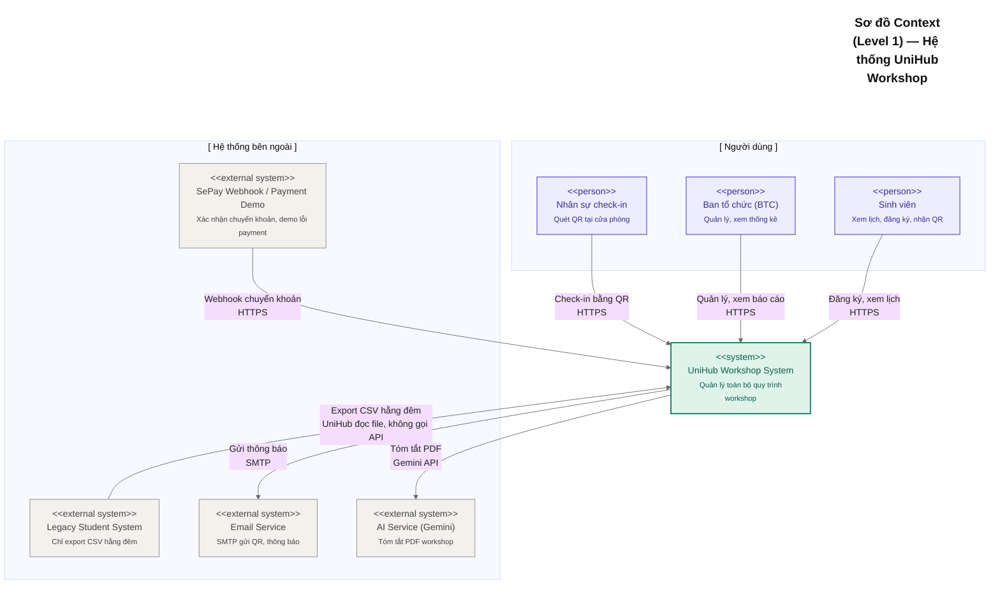
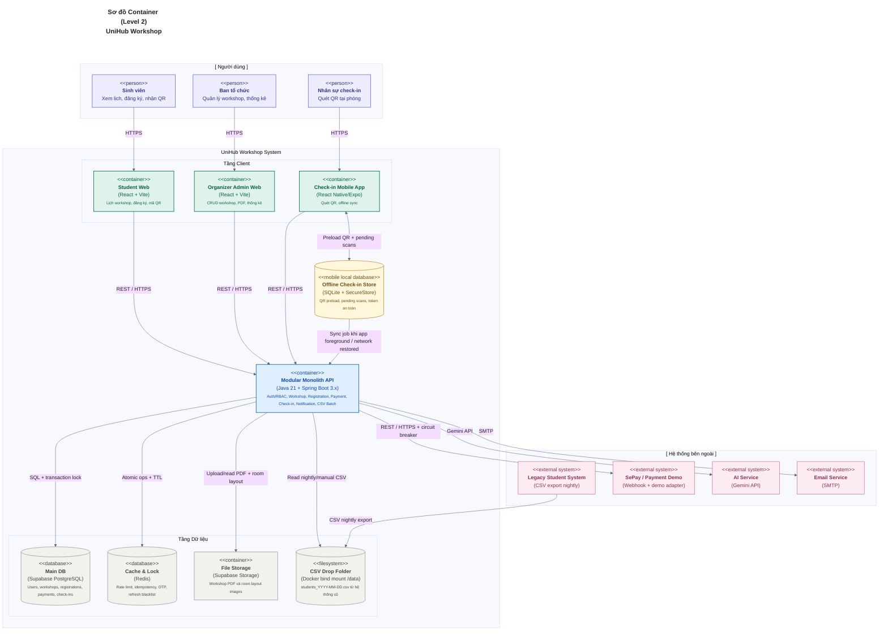
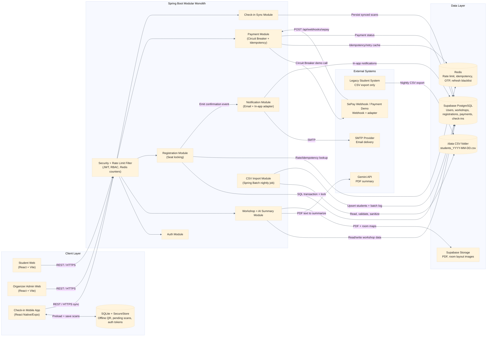
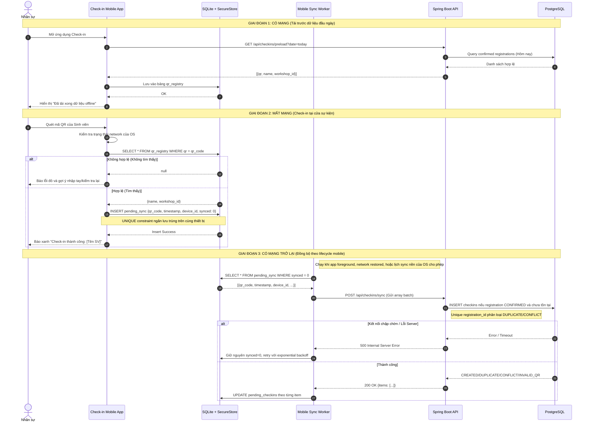
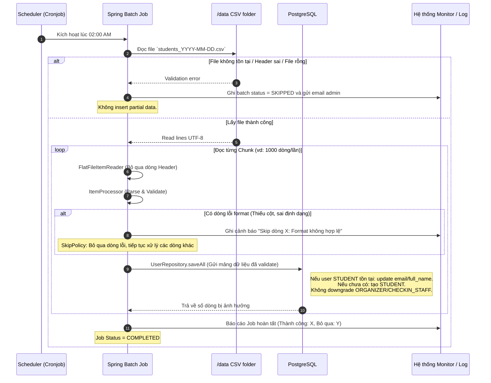

# UniHub Workshop — Technical Design

> **Stack đã chốt:** Java 21 + Spring Boot 3.5.x · React 18 + Vite cho Student/Admin Web · Check-in Mobile App native (React Native/Expo SDK 54) · Expo SQLite + SecureStore · Supabase (PostgreSQL + Storage + Realtime) · Redis · Gemini API · SMTP · CSV `/data` Docker bind mount · Docker Compose
>
> **Ưu tiên thiết kế:** Đề bài UniHub Workshop là source of truth. Blueprint phải mô tả đúng các yêu cầu bắt buộc trong đề: web sinh viên/admin, mobile check-in offline, AI Summary, CSV nightly import, RBAC 3 role, rate limiting, circuit breaker và idempotency. Các chi tiết triển khai được ghi theo codebase hiện tại nếu không mâu thuẫn với đề.
>
> **Phân công:** Thành viên 1 — Đăng ký & Giao dịch | Thành viên 2 — Quản trị & AI | Thành viên 3 — Vận hành & Đồng bộ

---

## 1. Kiến trúc tổng thể

### Lựa chọn kiến trúc: Modular Monolith

Nhóm chọn kiến trúc **Modular Monolith** cho backend Spring Boot. Toàn bộ nghiệp vụ nằm trong một deployable unit duy nhất, nhưng được tổ chức thành các module/package độc lập theo domain:

```
com.unihub.workshop
├── module.auth          (TV2 — Spring Security, JWT)
├── module.user          (TV2 — user profile, phone, Telegram)
├── module.workshop      (TV1, TV2 — CRUD, AI summary, Supabase Storage)
├── module.registration  (TV1 — đăng ký, seat locking)
├── module.payment       (TV1 — payment status, SePay webhook, refund, Circuit Breaker)
├── module.checkin       (TV3 — preload, lookup, sync offline)
├── module.notification  (TV3 — Email, in-app, adapter Telegram/SMS)
├── module.csvimport     (TV3 — Spring Batch orchestration)
└── module.studentimport (TV3 — batch history entity/repository)
```

**Lý do không chọn Microservices:**

| Tiêu chí                     | Modular Monolith           | Microservices                  |
| ---------------------------- | -------------------------- | ------------------------------ |
| Thời gian setup              | Thấp — 1 project, 1 repo   | Cao — nhiều repo, service mesh |
| Phù hợp nhóm 3 người, 1 tuần | ✅                         | ❌                             |
| Giao tiếp giữa module        | Method call (zero latency) | HTTP/gRPC (network overhead)   |
| Debug và test                | Dễ — chạy 1 service        | Khó — nhiều service cùng lúc   |
| Ranh giới module rõ ràng     | ✅ (package private)       | ✅                             |
| Có thể tách ra sau này       | ✅ (ranh giới đã có sẵn)   | N/A                            |

**Lý do chọn Java 21 + Spring Boot 3.x:**

- **Spring Batch:** Giải quyết bài toán CSV import phức tạp với cơ chế chunk processing, retry, skip, restart — không cần tự viết từ đầu.
- **Resilience4j + Redis:** Resilience4j dùng cho Circuit Breaker/Retry payment demo; Redis Sorted Set/lock dùng cho sliding-window rate limit, idempotency, refresh-token blacklist, OTP và seat queue guard.
- **Spring Security:** RBAC + JWT filter chain được thiết lập chặt chẽ, không để lọt request không hợp lệ qua bất kỳ tầng nào.
- **JPA + Pessimistic Locking:** `@Lock(LockModeType.PESSIMISTIC_WRITE)` giải quyết race condition chỗ ngồi trực tiếp ở tầng ORM.

---

## 2. C4 Diagram

### Level 1 — System Context

Sơ đồ này thể hiện UniHub Workshop trong bức tranh toàn cảnh: ai dùng hệ thống và hệ thống ngoài nào được tích hợp.



### Level 2 — Container Diagram

Sơ đồ này phân rã UniHub Workshop thành các container, chỉ rõ công nghệ và cách giao tiếp.



---

## 3. High-Level Architecture Diagram

Sơ đồ này thể hiện luồng dữ liệu và điểm tích hợp quan trọng, đặc biệt ở các tình huống phức tạp.



## 4. Thiết kế cơ sở dữ liệu

### Lựa chọn database

| Nhu cầu                                                                 | Lựa chọn                | Lý do                                                                                                              |
| ----------------------------------------------------------------------- | ----------------------- | ------------------------------------------------------------------------------------------------------------------ |
| Dữ liệu nghiệp vụ (users, workshops, registrations, payments, checkins) | **Supabase PostgreSQL** | ACID bắt buộc cho seat locking và thanh toán; Supabase có sẵn Real-time WebSocket để cập nhật số ghế trên frontend |
| Rate limiting counter, idempotency key cache, OTP, refresh-token blacklist | **Redis**             | Atomic operations (Sorted Set, SET NX EX), TTL tự động, dưới 1ms latency                                           |
| File storage (PDF, ảnh sơ đồ phòng)                                     | **Supabase Storage**    | S3-compatible, tích hợp sẵn với Supabase, dùng cho upload PDF và room layout                                       |
| CSV import source                                                       | **Filesystem `/data`**  | Đúng với đề "legacy export CSV ban đêm"; Docker Compose mount thư mục dữ liệu vào backend để Spring Batch đọc     |

**Không dùng NoSQL** cho dữ liệu nghiệp vụ vì: dữ liệu có quan hệ rõ ràng (user → registration → payment → workshop), cần JOIN và transaction ACID, và PostgreSQL Pessimistic Lock là công cụ chuẩn cho bài toán seat contention.

### Schema PostgreSQL hiện tại trên Supabase

```sql
-- =============================================
-- Spring Batch metadata tables
-- =============================================
CREATE TABLE public.batch_job_instance (
    job_instance_id BIGINT NOT NULL,
    version BIGINT,
    job_name VARCHAR NOT NULL,
    job_key VARCHAR NOT NULL,
    CONSTRAINT batch_job_instance_pkey PRIMARY KEY (job_instance_id)
);

CREATE TABLE public.batch_job_execution (
    job_execution_id BIGINT NOT NULL,
    version BIGINT,
    job_instance_id BIGINT NOT NULL,
    create_time TIMESTAMP WITHOUT TIME ZONE NOT NULL,
    start_time TIMESTAMP WITHOUT TIME ZONE,
    end_time TIMESTAMP WITHOUT TIME ZONE,
    status VARCHAR,
    exit_code VARCHAR,
    exit_message VARCHAR,
    last_updated TIMESTAMP WITHOUT TIME ZONE,
    CONSTRAINT batch_job_execution_pkey PRIMARY KEY (job_execution_id),
    CONSTRAINT job_inst_exec_fk FOREIGN KEY (job_instance_id)
        REFERENCES public.batch_job_instance(job_instance_id)
);

CREATE TABLE public.batch_job_execution_context (
    job_execution_id BIGINT NOT NULL,
    short_context VARCHAR NOT NULL,
    serialized_context TEXT,
    CONSTRAINT batch_job_execution_context_pkey PRIMARY KEY (job_execution_id),
    CONSTRAINT job_exec_ctx_fk FOREIGN KEY (job_execution_id)
        REFERENCES public.batch_job_execution(job_execution_id)
);

CREATE TABLE public.batch_job_execution_params (
    job_execution_id BIGINT NOT NULL,
    parameter_name VARCHAR NOT NULL,
    parameter_type VARCHAR NOT NULL,
    parameter_value VARCHAR,
    identifying CHAR NOT NULL,
    CONSTRAINT job_exec_params_fk FOREIGN KEY (job_execution_id)
        REFERENCES public.batch_job_execution(job_execution_id)
);

CREATE TABLE public.batch_step_execution (
    step_execution_id BIGINT NOT NULL,
    version BIGINT NOT NULL,
    step_name VARCHAR NOT NULL,
    job_execution_id BIGINT NOT NULL,
    create_time TIMESTAMP WITHOUT TIME ZONE NOT NULL,
    start_time TIMESTAMP WITHOUT TIME ZONE,
    end_time TIMESTAMP WITHOUT TIME ZONE,
    status VARCHAR,
    commit_count BIGINT,
    read_count BIGINT,
    filter_count BIGINT,
    write_count BIGINT,
    read_skip_count BIGINT,
    write_skip_count BIGINT,
    process_skip_count BIGINT,
    rollback_count BIGINT,
    exit_code VARCHAR,
    exit_message VARCHAR,
    last_updated TIMESTAMP WITHOUT TIME ZONE,
    CONSTRAINT batch_step_execution_pkey PRIMARY KEY (step_execution_id),
    CONSTRAINT job_exec_step_fk FOREIGN KEY (job_execution_id)
        REFERENCES public.batch_job_execution(job_execution_id)
);

CREATE TABLE public.batch_step_execution_context (
    step_execution_id BIGINT NOT NULL,
    short_context VARCHAR NOT NULL,
    serialized_context TEXT,
    CONSTRAINT batch_step_execution_context_pkey PRIMARY KEY (step_execution_id),
    CONSTRAINT step_exec_ctx_fk FOREIGN KEY (step_execution_id)
        REFERENCES public.batch_step_execution(step_execution_id)
);

-- =============================================
-- Bảng người dùng
-- =============================================
CREATE TABLE public.users (
    id UUID NOT NULL DEFAULT gen_random_uuid(),
    student_id VARCHAR UNIQUE,
    email VARCHAR NOT NULL UNIQUE,
    full_name VARCHAR NOT NULL,
    role VARCHAR NOT NULL DEFAULT 'STUDENT'::user_role,
    is_active BOOLEAN NOT NULL DEFAULT true,
    created_at TIMESTAMPTZ NOT NULL DEFAULT now(),
    updated_at TIMESTAMPTZ NOT NULL DEFAULT now(),
    password_hash VARCHAR NOT NULL,
    phone VARCHAR,
    telegram_id VARCHAR,
    CONSTRAINT users_pkey PRIMARY KEY (id)
);

-- =============================================
-- Bảng workshop
-- =============================================
CREATE TABLE public.workshops (
    id UUID NOT NULL DEFAULT gen_random_uuid(),
    title VARCHAR NOT NULL,
    description TEXT,
    speaker_name VARCHAR,
    speaker_bio TEXT,
    room VARCHAR NOT NULL,
    room_layout_url TEXT,
    start_time TIMESTAMPTZ NOT NULL,
    end_time TIMESTAMPTZ NOT NULL,
    capacity INTEGER NOT NULL CHECK (capacity > 0),
    remaining_seats INTEGER NOT NULL CHECK (remaining_seats >= 0),
    price NUMERIC NOT NULL DEFAULT 0.00,
    status VARCHAR NOT NULL DEFAULT 'DRAFT'::workshop_status,
    pdf_url TEXT,
    ai_summary TEXT,
    ai_summary_status VARCHAR DEFAULT 'NONE'::character varying,
    created_by UUID NOT NULL,
    created_at TIMESTAMPTZ NOT NULL DEFAULT now(),
    updated_at TIMESTAMPTZ NOT NULL DEFAULT now(),
    CONSTRAINT workshops_pkey PRIMARY KEY (id),
    CONSTRAINT workshops_created_by_fkey FOREIGN KEY (created_by)
        REFERENCES public.users(id)
);

-- =============================================
-- Bảng đăng ký
-- =============================================
CREATE TABLE public.registrations (
    id UUID NOT NULL DEFAULT gen_random_uuid(),
    user_id UUID NOT NULL,
    workshop_id UUID NOT NULL,
    status VARCHAR NOT NULL DEFAULT 'PENDING'::registration_status,
    qr_code VARCHAR UNIQUE,
    registered_at TIMESTAMPTZ NOT NULL DEFAULT now(),
    confirmed_at TIMESTAMPTZ,
    cancelled_at TIMESTAMPTZ,
    CONSTRAINT registrations_pkey PRIMARY KEY (id),
    CONSTRAINT registrations_user_id_fkey FOREIGN KEY (user_id)
        REFERENCES public.users(id),
    CONSTRAINT registrations_workshop_id_fkey FOREIGN KEY (workshop_id)
        REFERENCES public.workshops(id)
);

-- =============================================
-- Bảng thanh toán
-- =============================================
CREATE TABLE public.payments (
    id UUID NOT NULL DEFAULT gen_random_uuid(),
    registration_id UUID NOT NULL,
    idempotency_key VARCHAR NOT NULL UNIQUE,
    amount NUMERIC NOT NULL,
    status VARCHAR NOT NULL DEFAULT 'PENDING'::payment_status,
    gateway_ref VARCHAR,
    gateway_response JSONB,
    created_at TIMESTAMPTZ NOT NULL DEFAULT now(),
    updated_at TIMESTAMPTZ NOT NULL DEFAULT now(),
    CONSTRAINT payments_pkey PRIMARY KEY (id),
    CONSTRAINT payments_registration_id_fkey FOREIGN KEY (registration_id)
        REFERENCES public.registrations(id)
);

-- =============================================
-- Bảng yêu cầu hoàn tiền
-- =============================================
CREATE TABLE public.refund_requests (
    id UUID NOT NULL DEFAULT gen_random_uuid(),
    registration_id UUID NOT NULL UNIQUE,
    bank_name VARCHAR NOT NULL,
    bank_account_name VARCHAR NOT NULL,
    bank_account_number VARCHAR NOT NULL,
    proof_url TEXT NOT NULL,
    proof_note TEXT,
    processed BOOLEAN NOT NULL DEFAULT false,
    processed_at TIMESTAMPTZ,
    processed_by_user_id UUID,
    created_at TIMESTAMPTZ NOT NULL DEFAULT now(),
    updated_at TIMESTAMPTZ NOT NULL DEFAULT now(),
    CONSTRAINT refund_requests_pkey PRIMARY KEY (id),
    CONSTRAINT refund_requests_registration_id_fkey FOREIGN KEY (registration_id)
        REFERENCES public.registrations(id),
    CONSTRAINT refund_requests_processed_by_user_id_fkey FOREIGN KEY (processed_by_user_id)
        REFERENCES public.users(id)
);

-- =============================================
-- Bảng check-in
-- =============================================
CREATE TABLE public.checkins (
    id UUID NOT NULL DEFAULT gen_random_uuid(),
    registration_id UUID NOT NULL UNIQUE,
    checked_in_at TIMESTAMPTZ NOT NULL,
    synced_at TIMESTAMPTZ,
    device_id VARCHAR,
    created_at TIMESTAMPTZ NOT NULL DEFAULT now(),
    CONSTRAINT checkins_pkey PRIMARY KEY (id),
    CONSTRAINT checkins_registration_id_fkey FOREIGN KEY (registration_id)
        REFERENCES public.registrations(id)
);

-- =============================================
-- Bảng batch import CSV
-- =============================================
CREATE TABLE public.student_import_batches (
    id UUID NOT NULL DEFAULT gen_random_uuid(),
    file_name VARCHAR,
    total_rows INTEGER DEFAULT 0,
    success_rows INTEGER DEFAULT 0,
    error_rows INTEGER DEFAULT 0,
    status VARCHAR NOT NULL DEFAULT 'RUNNING'::character varying,
    error_log TEXT,
    started_at TIMESTAMPTZ NOT NULL DEFAULT now(),
    completed_at TIMESTAMPTZ,
    CONSTRAINT student_import_batches_pkey PRIMARY KEY (id)
);

-- =============================================
-- Bảng notification in-app
-- =============================================
CREATE TABLE public.notifications (
    id UUID NOT NULL,
    created_at TIMESTAMPTZ,
    updated_at TIMESTAMPTZ,
    body TEXT NOT NULL,
    data JSONB,
    is_read BOOLEAN NOT NULL,
    title VARCHAR NOT NULL,
    type VARCHAR NOT NULL,
    user_id UUID NOT NULL,
    CONSTRAINT notifications_pkey PRIMARY KEY (id),
    CONSTRAINT fk9y21adhxn0ayjhfocscqox7bh FOREIGN KEY (user_id)
        REFERENCES public.users(id)
);
```

### Bổ sung cần kiểm tra trên Supabase hiện tại

Schema export từ Supabase có thể thiếu một số constraint/index vì bảng được tạo qua nhiều lần migrate hoặc `SchemaInitializer`. Trước khi demo/chấm, cần bảo đảm các mục dưới đây tồn tại:

```sql
-- Mỗi sinh viên chỉ có một registration record cho một workshop.
-- Code reuse record CANCELLED dựa trên constraint này.
ALTER TABLE public.registrations
ADD CONSTRAINT registrations_user_workshop_unique UNIQUE (user_id, workshop_id);

-- Không để remaining_seats vượt capacity khi hủy/retry/promote waitlist.
ALTER TABLE public.workshops
ADD CONSTRAINT workshops_remaining_lte_capacity
CHECK (remaining_seats <= capacity);

-- Mã chuyển khoản UHxxxxxx phải match duy nhất một payment khi SePay webhook gọi về.
CREATE UNIQUE INDEX IF NOT EXISTS idx_payments_gateway_ref_unique
ON public.payments(gateway_ref)
WHERE gateway_ref IS NOT NULL;

-- Index hỗ trợ các màn hình danh sách/filter chính.
CREATE INDEX IF NOT EXISTS idx_registrations_user ON public.registrations(user_id);
CREATE INDEX IF NOT EXISTS idx_registrations_workshop ON public.registrations(workshop_id);
CREATE INDEX IF NOT EXISTS idx_registrations_status ON public.registrations(status);
CREATE INDEX IF NOT EXISTS idx_workshops_status ON public.workshops(status);
CREATE INDEX IF NOT EXISTS idx_workshops_start_time ON public.workshops(start_time);
CREATE INDEX IF NOT EXISTS idx_notifications_user_read ON public.notifications(user_id, is_read);
CREATE INDEX IF NOT EXISTS idx_refund_requests_processed ON public.refund_requests(processed);
```

Nếu constraint đã tồn tại với tên khác thì không cần tạo lại; chỉ cần xác nhận bằng `pg_constraint`/Supabase Table Editor. Với `registrations_user_workshop_unique`, cần xử lý dữ liệu trùng trước khi thêm constraint nếu database đã có duplicate lịch sử.

### Spring Batch metadata

Spring Batch cần các bảng metadata chuẩn ngoài bảng nghiệp vụ `student_import_batches`: `batch_job_instance`, `batch_job_execution`, `batch_job_execution_params`, `batch_job_execution_context`, `batch_step_execution`, `batch_step_execution_context` và các sequence tương ứng để cấp id. Nếu Supabase đã có các bảng `batch_*` nhưng thiếu sequence, CSV import có thể fail khi `JobRepository` tạo job execution mới.

Các sequence cần kiểm tra:

```sql
CREATE SEQUENCE IF NOT EXISTS public.batch_job_seq START WITH 1 INCREMENT BY 1;
CREATE SEQUENCE IF NOT EXISTS public.batch_job_execution_seq START WITH 1 INCREMENT BY 1;
CREATE SEQUENCE IF NOT EXISTS public.batch_step_execution_seq START WITH 1 INCREMENT BY 1;
```

### Redis Key Convention

| Key Pattern | Type | TTL | Mục đích |
| ----------- | ---- | --- | -------- |
| `idem:{principal}:{uuid}` | String (JSON) | 24h | Cache response `POST /api/registrations` theo user + Idempotency-Key |
| `idem:{principal}:payment-retry:{encoded}` | String (JSON) | 24h | Cache response retry payment theo registration + user |
| `rate:registration:{principal}` | Sorted Set | 10s | Sliding window rate limit cho đăng ký |
| `rate:workshop-read:{principal}` | Sorted Set | 10s | Sliding window rate limit cho đọc danh sách/chi tiết workshop |
| `lock:registration:student:{email}:{workshopId}` | String | 10s | Chặn cùng một student gửi song song nhiều request đăng ký cùng workshop |
| `lock:registration:workshop:{workshopId}` | String | 10s | Chặn hàng đợi cập nhật seat bị chạy song song quá mức |
| `email:*` | String | 7 ngày | Dedup email xác nhận, hủy workshop, cập nhật workshop, hoàn tiền |

---

## 5. Thiết kế kiểm soát truy cập (RBAC)

### 5.1. Mục tiêu
Hệ thống UniHub Workshop có nhiều nhóm người dùng với quyền hạn khác nhau. Vì vậy, hệ thống cần có cơ chế kiểm soát truy cập để đảm bảo mỗi người dùng chỉ được thực hiện đúng các chức năng thuộc phạm vi của mình: Sinh viên chỉ được xem và đăng ký workshop; Ban tổ chức (BTC) được quản lý workshop; Nhân sự chỉ được thực hiện quét QR check-in.

### 5.2. Mô hình kiểm soát truy cập
Hệ thống áp dụng mô hình **RBAC (Role-Based Access Control)** thông qua Spring Security + JWT. Trong phạm vi đồ án chỉ có 3 role đúng với đề bài và schema PostgreSQL: `STUDENT`, `ORGANIZER`, `CHECKIN_STAFF`. Mỗi JWT access token chứa claim `role`; backend dùng claim này để kiểm tra quyền ở tầng route và method.

```json
{
  "sub": "550e8400-e29b-41d4-a716-446655440000",
  "email": "nguyenvana@university.edu.vn",
  "role": "STUDENT",
  "iat": 1748908800,
  "exp": 1748995200
}
```

### 5.3. Các vai trò trong hệ thống
* **STUDENT (Sinh viên):** Xem lịch workshop, đăng ký workshop, nhận mã QR và xem trạng thái check-in của chính mình.
* **ORGANIZER (Ban tổ chức):** Tạo, sửa, hủy workshop, upload tài liệu PDF giới thiệu, xem danh sách sinh viên đăng ký và xem báo cáo thống kê.
* **CHECKIN_STAFF (Nhân sự check-in):** Preload danh sách QR hợp lệ, quét QR tại cửa phòng và đồng bộ các lượt check-in offline.

Tài khoản `ORGANIZER` và `CHECKIN_STAFF` được tạo thủ công qua seed data/DBA cho phạm vi đồ án, không mở API public để tự gán role. Vì vậy hệ thống không định nghĩa role `ADMIN` riêng trong runtime; các đường dẫn quản trị nghiệp vụ thuộc role `ORGANIZER`.

### 5.4. Phân quyền chức năng (Functional Permissions)

| Chức năng / Endpoint | STUDENT | ORGANIZER | CHECKIN_STAFF |
| :--- | :---: | :---: | :---: |
| Xem danh sách / chi tiết workshop (`GET /api/workshops/**`) | ✅ | ✅ | ✅ |
| Đăng ký workshop (`POST /api/registrations/**`) | ✅ | ❌ | ❌ |
| Xem registration / mã QR của chính mình (`GET /api/registrations/my/**`) | ✅ | ❌ | ❌ |
| Tạo / cập nhật / hủy workshop (`POST/PUT/DELETE /api/workshops/**`) | ❌ | ✅ | ❌ |
| Upload PDF giới thiệu workshop (`POST /api/workshops/{id}/pdf`) | ❌ | ✅ | ❌ |
| Xem danh sách sinh viên đăng ký / thống kê (`GET /api/workshops/admin`, `GET /api/workshops/statistics`, `GET /api/admin/**`) | ❌ | ✅ | ❌ |
| Chọn workshop theo ngày / preload / lookup QR (`GET /api/checkins/workshops`, `GET /api/checkins/preload`, `GET /api/checkins/lookup`) | ❌ | ❌ | ✅ |
| Quét QR / đồng bộ check-in offline (`POST /api/checkins/sync`) | ❌ | ❌ | ✅ |
| Xem danh sách lượt check-in của workshop (`GET /api/checkins/workshops/{workshopId}`) | ❌ | ✅ | ❌ |

### 5.5. Kiểm soát truy cập tại API Endpoint
Tất cả request từ Student Web, Organizer Admin Web và Check-in Mobile App đều phải đi qua Backend API do Backend API là nơi kiểm tra quyền chính thức của hệ thống. Frontend chỉ ẩn/hiện route và nút chức năng theo role để cải thiện UX; bảo mật thật sự phải được kiểm tra ở backend.

**Quy trình kiểm tra quyền tại API:**
1. Người dùng đăng nhập vào hệ thống.
2. Backend xác thực tài khoản và trả về **JWT Access Token**.
3. Client lưu token và gửi token trong mỗi request: `Authorization: Bearer <access_token>`.
4. `JwtAuthenticationFilter` kiểm tra token có tồn tại, hợp lệ và chưa hết hạn.
5. Backend kiểm tra role của user với endpoint đang được gọi.
6. Nếu không đăng nhập hoặc token sai, trả về `401 Unauthorized`.
7. Nếu token đúng nhưng role không đủ quyền, trả về `403 Forbidden`.

**Triển khai trong Spring Security (Thành viên 2):**

**Tầng 1 — HTTP Security Config:**

```java
@Bean
public SecurityFilterChain filterChain(HttpSecurity http) throws Exception {
    http
        .csrf(AbstractHttpConfigurer::disable)
        .sessionManagement(s -> s.sessionCreationPolicy(STATELESS))
        .authorizeHttpRequests(auth -> auth
            // Public endpoints
            .requestMatchers(GET, "/api/workshops/**").permitAll()
            .requestMatchers(POST, "/api/auth/**").permitAll()

            // Student only
            .requestMatchers(POST, "/api/registrations/**").hasRole("STUDENT")
            .requestMatchers(GET, "/api/registrations/my/**").hasRole("STUDENT")

            // Organizer only
            .requestMatchers("/api/admin/**").hasRole("ORGANIZER")
            .requestMatchers(POST, "/api/workshops/**").hasRole("ORGANIZER")
            .requestMatchers(PUT, "/api/workshops/**").hasRole("ORGANIZER")
            .requestMatchers(DELETE, "/api/workshops/**").hasRole("ORGANIZER")

            // Check-in staff only
            .requestMatchers("/api/checkins/**").hasAnyRole("CHECKIN_STAFF", "ORGANIZER")

            .anyRequest().authenticated()
        )
        .addFilterBefore(jwtAuthenticationFilter,
                         UsernamePasswordAuthenticationFilter.class);
    return http.build();
}
```

**Tầng 2 — Method-level Security (defense in depth):**

Trong codebase hiện tại, `SecurityConfig` cho phép cả `CHECKIN_STAFF` và `ORGANIZER` đi qua namespace `/api/checkins/**`, nhưng quyền thực tế được chốt tại controller bằng `@PreAuthorize`: staff chỉ được dùng preload/lookup/sync, organizer chỉ được xem danh sách lượt check-in của một workshop.

```java
@Service
@PreAuthorize("hasRole('ORGANIZER')")
public class WorkshopAdminService {
    public Workshop createWorkshop(CreateWorkshopRequest req) { ... }
    public Workshop updateWorkshop(UUID id, UpdateWorkshopRequest req) { ... }
}
```

**Tầng 3 — Data-level: SV chỉ xem được registration của chính mình:**

```java
@GetMapping("/registrations/my")
public List<RegistrationDto> getMyRegistrations(
        @AuthenticationPrincipal UserDetails user) {
    // userDetails.getId() lấy từ JWT, không tin vào request param
    return registrationService.findByUserId(user.getId());
}
```

**Tầng 4 — Frontend route guard theo role:**

```jsx
<RoleGuard allowedRoles={['STUDENT']}>
  <StudentLayout />
</RoleGuard>

<RoleGuard allowedRoles={['ORGANIZER']}>
  <OrganizerLayout />
</RoleGuard>

<RoleGuard allowedRoles={['CHECKIN_STAFF']}>
  <CheckinLayout />
</RoleGuard>
```

Route guard chỉ là lớp hỗ trợ giao diện. Người dùng tự sửa URL hoặc token không hợp lệ vẫn bị backend chặn ở tầng Spring Security.

---

## 6. Luồng nghiệp vụ quan trọng

### Luồng A — Đăng ký Workshop có phí (Thành viên 1)

Từ lúc sinh viên bấm "Đăng ký" đến khi nhận mã QR.

```
SV (Browser)         React Frontend        Spring Boot API         Redis / PostgreSQL
      │                     │                     │                       │
      │── Click "Đăng ký" ─▶│                     │                       │
      │                     │ Sinh idempotencyKey  │                       │
      │                     │ = UUID.randomUUID()  │                       │
      │                     │                     │                       │
      │                     │──POST /registrations▶│                       │
      │                     │  Header:             │                       │
      │                     │  Idempotency-Key:    │                       │
      │                     │  {uuid}              │                       │
      │                     │  Body: {workshopId}  │                       │
      │                     │                     │                       │
      │                     │                     │── ① Rate limit check ─▶│ Redis ZSET rate:registration:{email}
      │                     │                     │◀─ OK (< 5 req/10s) ───│
      │                     │                     │   hoặc 429 (exceeded) │
      │                     │                     │                       │
      │                     │                     │── ② Idem key check ──▶│ Redis GET idem:{email}:{key}
      │                     │                     │◀─ null (chưa có) ─────│
      │                     │                     │   (nếu có → return    │
      │                     │                     │    cached response)   │
      │                     │                     │                       │
      │                     │                     │── ③ BEGIN TRANSACTION ─▶│ PostgreSQL
      │                     │                     │   SELECT * FROM         │
      │                     │                     │   workshops             │
      │                     │                     │   WHERE id = ?          │
      │                     │                     │   FOR UPDATE            │ ← Pessimistic Lock
      │                     │                     │                         │
      │                     │                     │   remaining_seats = 0?  │
      │                     │                     │   → INSERT WAITLISTED   │
      │                     │                     │   → COMMIT              │
      │                     │                     │                         │
      │                     │                     │   INSERT registrations  │
      │                     │                     │   status = 'PENDING'    │
      │                     │                     │                         │
      │                     │                     │   UPDATE workshops      │
      │                     │                     │   SET remaining_seats   │
      │                     │                     │       = remaining_seats │
      │                     │                     │       - 1               │
      │                     │                     │                         │
      │                     │                     │   INSERT payments       │
      │                     │                     │   status = 'PENDING'    │
      │                     │                     │   gateway_ref='UHxxxxxx'│
      │                     │                     │── COMMIT ───────────────│
      │                     │                     │                         │
      │                     │                     │── ④ Cache idem key ────▶│ Redis SET idem:{email}:{key}
      │                     │                     │                    EX 86400
      │                     │◀── 201 {registrationId,status:PENDING}────────│
      │                     │──GET /payment-info───────────────────────────▶│
      │                     │◀── {paymentCode,amount,bank}─────────────────│
      │◀── Hiển thị QR SePay / thông tin chuyển khoản                       │
      │                     │                     │                         │
      │                     │                     │◀─── [SePay webhook] ─────
      │                     │                     │   POST /api/webhooks/sepay
      │                     │                     │   content contains UHxxxxxx
      │                     │                     │   amount >= payment.amount
      │                     │                     │   UPDATE payments SUCCESS│
      │                     │                     │   UPDATE registrations CONFIRMED
      │                     │                     │   qr_code = UUID.new()  │
      │                     │                     │   Send notification/email│
      │                     │                     │                         │
      │                     │                     │◀─── [Payment timeout] ───
      │                     │                     │   Scheduler sau 15 phút │
      │                     │                     │   UPDATE payments FAILED│
      │                     │                     │   UPDATE registrations CANCELLED
      │                     │                     │   remaining_seats += 1/promote waitlist
```

**Kịch bản client retry với cùng idempotency key:**

```
Client gửi lại request với cùng Idempotency-Key
→ API: Redis GET idem:{email}:{key} → Tìm thấy response cũ
→ Return cached response ngay, không xử lý lại
→ Header: X-Idempotent-Replayed: true
```

### Luồng B — Check-in offline và đồng bộ (Thành viên 3)



```
Nhân sự        Mobile App        Local SQLite        Spring Boot API        PostgreSQL
   │               │                  │                    │                  │
   │ [Trước sự kiện - có mạng]        │                    │                  │
   │── Mở app ───▶│                  │                    │                  │
   │               │── GET /checkins/preload?date=today ─▶│                  │
   │               │                  │                    │── Query confirmed registrations
   │               │◀── [{qr, name, workshopId}] ─────────│                  │
   │               │── Cache QR registry ────────────────▶│                  │
   │◀── "Đã tải xong"                                      │                  │
   │ [Tại cửa phòng - mất mạng]         │                  │                  │
   │── Quét QR SV ─▶│                  │                  │                  │
   │               │── Lookup local QR ─────────────────▶│                  │
   │               │◀── {name, workshop} ────────────────│                  │
   │               │── Save pending check-in ───────────▶│                  │
   │◀── "Check-in OK"                                     │                  │
   │ [Khi mạng trở lại / app foreground]                  │                  │
   │               │── Read pending rows ───────────────▶│                  │
   │               │── POST /checkins/sync ───────────────▶│
   │               │                  │                    │── INSERT/validate checkins
   │               │◀── {items:[CREATED/...]} ───────────│
   │               │── Mark result per row ─────────────▶│
```

**Xử lý lỗi:**

| Tình huống                   | Hành vi                                                                                              |
| ---------------------------- | ---------------------------------------------------------------------------------------------------- |
| QR không có trong local DB   | Hiện "Không tìm thấy sinh viên", ghi log, cho phép nhập tay/kiểm tra lại                             |
| Sync thất bại (mạng đứt lại) | Giữ nguyên `synced=0`, mobile sync worker retry khi có mạng hoặc app foreground                      |
| Check-in trùng (SV đã scan)  | SQLite flag/local pending ngăn lưu trùng local; unique `registration_id` trên PostgreSQL giúp backend trả `DUPLICATE` hoặc `CONFLICT` |
| File preload quá lớn         | Phân trang theo `workshop_id`, chỉ load workshop của ngày hôm nay                                    |

---
### Luồng C — Luồng nhập dữ liệu từ CSV đêm (Thành viên 3)



## 7. Thiết kế các cơ chế bảo vệ hệ thống

### 7.1 Kiểm soát tải đột biến — Rate Limiting (Thành viên 1)

**Lý do chọn Sliding Window Redis:**

So sánh các thuật toán:

| Thuật toán     | Điểm mạnh           | Điểm yếu                            | Phù hợp bài này? |
| -------------- | ------------------- | ----------------------------------- | ---------------- |
| Fixed Window   | Đơn giản            | Burst cuối window: 2× rate trong 1s | ❌               |
| Sliding Window | Công bằng, smooth   | Tốn RAM hơn chút                    | ✅ Chọn          |
| Token Bucket   | Cho phép burst ngắn | Khó integrate với Resilience4j      | Có thể           |
| Leaky Bucket   | Rate đều tuyệt đối  | Queue delay — không công bằng       | ❌               |

Sliding Window được chọn vì công bằng hơn fixed window ở biên thời gian. Code hiện dùng Redis Sorted Set trong `RegistrationSlidingWindowService` và `WorkshopReadSlidingWindowService`; Resilience4j ratelimiter config vẫn là cấu hình tham chiếu nhưng không phải cơ chế chính.

**Cấu hình (application.yml):**

```yaml
resilience4j:
  ratelimiter:
    instances:
      registration:
        limitForPeriod: 5 # 5 requests
        limitRefreshPeriod: 10s # mỗi 10 giây
        timeoutDuration: 0 # fail fast, không queue
      workshop-read:
        limitForPeriod: 30
        limitRefreshPeriod: 10s
        timeoutDuration: 0
```

**Triển khai (Thành viên 1):**

```java
@PostMapping("/registrations")
public ResponseEntity<ApiResponse<RegistrationResponse>> register(
        @RequestHeader("Idempotency-Key") String idempotencyKey,
        @Valid @RequestBody RegistrationRequest request,
        Authentication authentication) {
    if (!registrationSlidingWindowService.tryAcquire(authentication.getName())) {
        long retryAfter = registrationSlidingWindowService.retryAfterSeconds();
        return ResponseEntity.status(429)
            .header("Retry-After", String.valueOf(retryAfter))
            .body(ApiResponse.error(429, "RATE_LIMIT_EXCEEDED",
                "Quá nhiều yêu cầu. Vui lòng thử lại sau " + retryAfter + " giây."));
    }
    return ResponseEntity.status(201).body(ApiResponse.success(...));
}
```

**Hành vi khi vượt ngưỡng:**

- HTTP 429 với JSON body rõ ràng + header `Retry-After: 10`
- Frontend hiển thị countdown timer, nút đăng ký bị disable
- Không ghi log cho mỗi lần 429 (tránh log flooding)

**Bảo vệ bổ sung tầng Nginx (nếu deploy):**

```nginx
limit_req_zone $binary_remote_addr zone=api:10m rate=60r/m;
limit_req zone=api burst=20 nodelay;
limit_req_status 429;
```

---

### 7.2 Xử lý cổng thanh toán không ổn định — Circuit Breaker (Thành viên 1)

**Cơ chế hoạt động 3 trạng thái:**

```
Trạng thái CLOSED (bình thường):
  → Mọi request demo gọi Payment Gateway bình thường
  → Đếm failures trong sliding window (10 calls gần nhất)
  → failure rate ≥ 50% → chuyển sang OPEN

Trạng thái OPEN (đang sự cố):
  → Chặn TẤT CẢ request demo gọi Payment Gateway
  → Trả về lỗi ngay lập tức (không chờ timeout)
  → Sau 30 giây → chuyển sang HALF-OPEN
  → Tính năng KHÔNG liên quan đến thanh toán:
    xem workshop, tìm kiếm, xem QR — vẫn hoạt động 100%

Trạng thái HALF-OPEN (đang thử phục hồi):
  → Cho phép 1 request thử đi qua
  → Thành công → CLOSED (phục hồi)
  → Thất bại → OPEN lại (thêm 30 giây)
```

**Cấu hình (application.yml):**

```yaml
resilience4j:
  circuitbreaker:
    instances:
      payment:
        slidingWindowType: COUNT_BASED
        slidingWindowSize: 10 # Tính trên 10 calls gần nhất
        failureRateThreshold: 50 # 50% failure → OPEN
        slowCallRateThreshold: 80 # 80% slow → cũng tính là failure
        slowCallDurationThreshold: 2000ms # Call > 2s = slow
        waitDurationInOpenState: 30s # OPEN kéo dài 30s
        permittedNumberOfCallsInHalfOpenState: 1
        automaticTransitionFromOpenToHalfOpenEnabled: true
```

**Triển khai (Thành viên 1):**

```java
@Service
public class PaymentService {

    @CircuitBreaker(name = "payment", fallbackMethod = "paymentFallback")
    @Retry(name = "payment")  // Retry 2 lần trước khi tính là failure
    public Payment processPayment(Payment payment) {
        PaymentStatus status = paymentGatewayClient.processPayment(
            payment.getGatewayRef(), payment.getAmount());
        payment.setStatus(status);
        payment.setGatewayResponse("{\"status\":\"" + status.name() + "\"}");
        return paymentRepository.save(payment);
    }

    // Fallback khi CB OPEN hoặc sau khi hết retry
    public Payment paymentFallback(Payment payment, Exception ex) {
        log.warn("Payment CB triggered: {}", ex.getMessage());
        throw new AppException(ErrorCode.PAYMENT_UNAVAILABLE,
            "Payment service is currently unavailable");
    }
}
```

**Graceful Degradation — Frontend nhận response:**

```json
// HTTP 503
{
  "status": 503,
  "code": "PAYMENT_UNAVAILABLE",
  "message": "Hệ thống thanh toán đang gián đoạn. Vui lòng thử lại sau ít phút.",
  "data": null
}
```

Frontend hiển thị cảnh báo chỉ trên luồng payment demo/gateway lỗi. Trang xem danh sách workshop, trang chi tiết, tính năng check-in và SePay webhook — không bị ảnh hưởng.

---

### 7.3 Chống trừ tiền hai lần — Idempotency Key (Thành viên 1)

**Cơ chế hoạt động:**

```
TRƯỚC KHI GỌI API:
  Client (React) sinh idempotencyKey = crypto.randomUUID()
  Lưu vào sessionStorage theo workshopId

GỌI API LẦN 1:
  POST /api/registrations
  Header: Idempotency-Key: "550e8400-e29b-41d4-a716-446655440000"

  Server:
  1. Redis GET "idem:{principal}:550e8400-..."  → null (chưa có)
  2. Xử lý registration/payment pending (atomic transaction)
  3. Redis SET "idem:{principal}:550e8400-..." "{response_json}" EX 86400
     (SET NX — chỉ set nếu key chưa tồn tại, atomic)
  4. Return response

CLIENT TIMEOUT → RETRY (cùng key):
  POST /api/registrations
  Header: Idempotency-Key: "550e8400-e29b-41d4-a716-446655440000"

  Server:
  1. Redis GET "idem:{principal}:550e8400-..."  → "{...response cũ...}"
  2. Return cached response NGAY
     Header: X-Idempotent-Replayed: true
  3. KHÔNG tạo duplicate registration/payment
```

**Triển khai (Thành viên 1):**

```java
@Component
public class IdempotencyService {
    private final RedisTemplate<String, String> redisTemplate;
    private static final Duration TTL = Duration.ofHours(24);

    public Optional<String> getCachedResponse(String key, String principal) {
        try {
            String value = redisTemplate.opsForValue().get("idem:" + principal + ":" + key);
            return Optional.ofNullable(value);
        } catch (Exception e) {
            log.warn("Redis unavailable for idempotency check, proceeding without cache");
            return Optional.empty();  // Fail open: tiếp tục xử lý nếu Redis down
        }
    }

    public void cacheResponse(String key, String principal, Object response) {
        String json = objectMapper.writeValueAsString(response);
        redisTemplate.opsForValue().set("idem:" + principal + ":" + key, json, TTL);
    }
}
```

**Ràng buộc bảo mật:**

- Key được bind với `userId` trong validation: key của user A không thể được user B dùng
- TTL 24h: sau 1 ngày key hết hạn, đủ để cover mọi retry trong ngày sự kiện
- Key phải là UUID v4 hợp lệ — bác bỏ key không đúng format với 422

---

## 8. Thiết kế AI Summary (Thành viên 2)

```
Organizer               Spring Boot               Supabase Storage    Gemini API     PostgreSQL
  │                          │                          │                  │               │
  │── Upload PDF ───────────▶│                          │                  │               │
  │                          │── Store PDF ────────────▶│                  │               │
  │                          │◀── pdf_url ──────────────│                  │               │
  │                          │── UPDATE workshops ───────│──────────────────│──────────────▶│
  │                          │   pdf_url = ...,          │                  │               │
  │                          │   ai_summary_status =     │                  │               │
  │                          │   'PROCESSING'            │                  │               │
  │◀── 202 Accepted ─────────│                          │                  │               │
  │    (xử lý nền)           │                          │                  │               │
  │                          │── @Async processAiSummary │                  │               │
  │                          │── Download PDF bytes ────▶│                  │               │
  │                          │◀── PDF bytes ─────────────│                  │               │
  │                          │── Extract text            │                  │               │
  │                          │   (Apache PDFBox)         │                  │               │
  │                          │── Clean text              │                  │               │
  │                          │   (remove headers/footers)│                  │               │
  │                          │── POST generateContent ───│──────────────────▶│              │
  │                          │   {model: gemini-pro,     │                  │               │
  │                          │    contents: [{           │                  │               │
  │                          │      text: "Tóm tắt nội  │                  │               │
  │                          │      dung workshop sau:" │                  │               │
  │                          │      + extractedText}]}   │                  │               │
  │                          │◀── {summary_text} ────────│──────────────────│               │
  │                          │── UPDATE workshops ───────│──────────────────│──────────────▶│
  │                          │   ai_summary = ...,       │                  │               │
  │                          │   ai_summary_status = 'DONE'                 │               │
```

**Xử lý lỗi:** Nếu Gemini API thất bại → `ai_summary_status = 'FAILED'` → Ban tổ chức thấy nút "Thử lại". Không ảnh hưởng đến trang chi tiết workshop (chỉ không hiển thị phần AI Summary).

---

## 9. Thiết kế CSV Import (Thành viên 3)

**Cấu trúc Spring Batch Job:**

```
StudentImportJob
  │
  ├── Step 1: Preprocess/Validate CSV
  │   ├── Kiểm tra file tồn tại (/data/students_{date}.csv)
  │   ├── Kiểm tra header đúng format (student_id,full_name,email hoặc studentId,fullName,email)
  │   ├── Validate từng dòng, ghi line number/error reason
  │   ├── Dedupe student_id, giữ dòng hợp lệ cuối cùng
  │   ├── Ghi file tạm sanitized cho Spring Batch đọc
  │   ├── Lỗi → INSERT batch record status='SKIPPED', gửi alert email admin
  │   └── OK → tiếp tục Step 2
  │
  ├── Step 2: ImportStudentsStep (chunk-oriented, size=100)
  │   ├── ItemReader: FlatFileItemReader
  │   │   └── Đọc CSV, skip header row, encoding UTF-8
  │   ├── ItemProcessor:
  │   │   ├── Validate student_id không rỗng
  │   │   ├── Validate email format
  │   │   ├── Normalize: email.toLowerCase().trim()
  │   │   ├── Skip row không hợp lệ (SkipPolicy: ghi log, tiếp tục)
  │   │   └── Map → UserEntity (role=STUDENT, is_active=true)
  │   └── ItemWriter: UserRepository.saveAll(...)
  │       ├── Nếu user STUDENT tồn tại: update full_name/email
  │       ├── Nếu user chưa tồn tại: tạo STUDENT với password mặc định
  │       └── KHÔNG downgrade ORGANIZER/CHECKIN_STAFF, KHÔNG ảnh hưởng registrations đang có
  │
  └── Step 3: ReportTasklet
      └── UPDATE student_import_batches
          SET status='COMPLETED', success_rows=?, error_rows=?,
              error_log=?, completed_at=now()
```

**Cron trigger:**

```java
@Scheduled(cron = "0 0 2 * * *", zone = "Asia/Ho_Chi_Minh")  // 2:00 AM mỗi ngày
public void runCsvImportJob() {
    csvImportScheduler.runImportJob();
}
```

---

## 10. Các quyết định kỹ thuật quan trọng (ADR)

### ADR-01: Chọn Supabase thay vì self-hosted PostgreSQL

**Quyết định:** Dùng Supabase (managed PostgreSQL).

**Lý do:**

- Supabase Real-time cung cấp WebSocket subscription cho số ghế còn lại — frontend tự động cập nhật mà không cần polling.
- Supabase Storage tích hợp sẵn cho file PDF và ảnh sơ đồ phòng.
- Free tier đủ cho đồ án, không cần cấu hình DB server.

**Đánh đổi:** Phụ thuộc vào vendor. Nếu Supabase có downtime, toàn bộ system affected.

---

### ADR-02: Chọn Check-in Mobile App native cho luồng vận hành

**Quyết định:** Dùng ứng dụng mobile native cho nhân sự check-in, ưu tiên React Native/Expo để tận dụng lại kinh nghiệm React nhưng vẫn có API native cho camera, local database, bảo mật token và đồng bộ theo lifecycle của thiết bị.

**Lý do:**

- Yêu cầu mới chuyển luồng check-in khỏi giải pháp web offline cũ, nên cơ chế đồng bộ và lưu trữ của trình duyệt không còn là implementation chính.
- Mobile native kiểm soát camera permission, network recovery, app foreground/background và lưu trữ offline ổn định hơn khi check-in tại cửa phòng.
- SQLite phù hợp cho QR registry và pending scans; SecureStore/Keychain/Keystore phù hợp cho access token, refresh token và device id.
- Có thể demo trên emulator hoặc thiết bị thật mà không phụ thuộc giới hạn browser/mobile Safari.

**Đánh đổi:** Cần thêm build mobile và quy trình test thiết bị/emulator. Để giảm rủi ro, backend giữ API REST `/api/checkins/preload` và `/api/checkins/sync`; web check-in hiện có chỉ còn là công cụ debug nội bộ, không phải container chính trong kiến trúc.

---

### ADR-03: Pessimistic Locking thay vì Optimistic Locking cho seat

**Quyết định:** Dùng `SELECT FOR UPDATE` (Pessimistic Lock).

**Lý do:**

- Workshop 60 chỗ với hàng trăm request đồng thời → Optimistic Lock sẽ gây ra rất nhiều retry (version conflict), trải nghiệm SV xấu.
- Pessimistic Lock đảm bảo đúng một SV được xử lý tại một thời điểm cho mỗi workshop.
- Transaction ngắn (< 100ms) nên lock không giữ lâu.

**Đánh đổi:** Throughput thấp hơn một chút, nhưng correctness tuyệt đối quan trọng hơn.

---

### ADR-04: Chọn Gemini API thay vì OpenAI

**Quyết định:** Dùng Google Gemini API cho AI Summary.

**Lý do:** Google cung cấp free tier Gemini API đủ cho đồ án, không cần billing setup. OpenAI yêu cầu credit card ngay từ đầu.

**Đánh đổi:** API response format khác nhau, nhưng không ảnh hưởng nghiệp vụ.

---

### ADR-05: Một codebase React cho Student Web và Organizer Admin Web

**Quyết định:** Một React + Vite project cho Student Web và Organizer Admin Web, routing theo role. Luồng check-in chính chuyển sang mobile app native riêng và chỉ dùng chung Backend API contract.

**Lý do:**

- Student và Organizer dùng chung component library, tránh duplicate code.
- Build ra 1 bundle, deploy 1 nơi.
- Protected routes theo role: `/admin/*` chỉ cho ORGANIZER; các route `/checkin/*` trong web chỉ là công cụ debug tạm thời, không đại diện cho container chính.

**Đánh đổi:** Bundle size lớn hơn. Giải pháp: React lazy loading + code splitting theo route.
